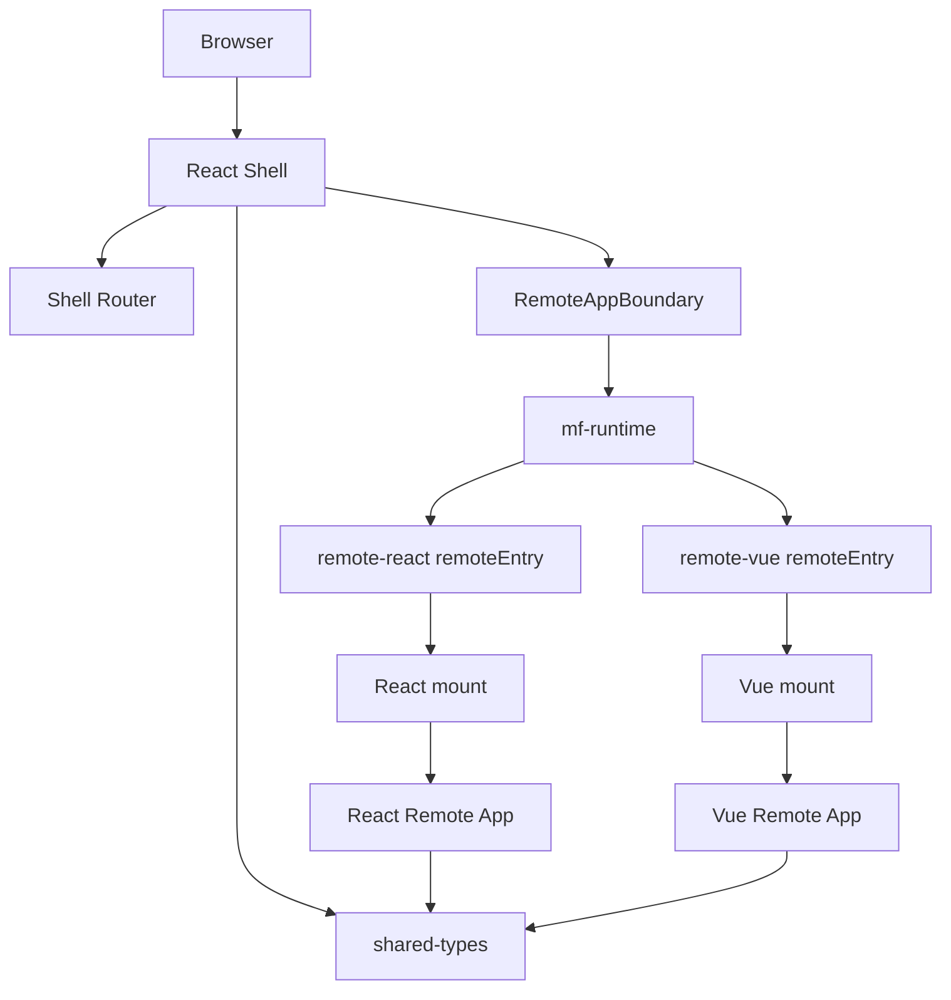

# Rspack 微前端框架架构文档（阶段一）

## 目标范围

阶段一目标是搭建一个可运行、可验证、可继续演进的微前端基础架子。当前实现聚焦最小闭环：

- 使用 `pnpm workspace` 和 `Turbo` 管理 monorepo。
- 使用 `Rspack` 和 `@module-federation/enhanced/rspack` 跑通模块联邦。
- 使用 React 作为 Shell 主应用。
- 提供一个 React Remote 和一个 Vue Remote。
- React/Vue 子应用通过统一 `mount/unmount` 生命周期协议接入 Shell。
- 提供基础类型、运行时加载、共享 Rspack 配置和文档。

阶段一暂不解决完整生产治理问题，例如动态 remote manifest、权限系统、灰度发布、强样式隔离、CLI、复杂沙箱和跨团队组件平台。

## 技术栈

- Node.js `>=18`
- pnpm workspace
- Turbo
- TypeScript
- Rspack
- `@module-federation/enhanced/rspack`
- React
- Vue 3
- React Router
- Vue Router
- Vitest

## 项目结构

```text
federlet/
  apps/
    shell-react/
    remote-react/
    remote-vue/
  packages/
    mf-runtime/
    rspack-config/
    shared-types/
    shared-ui/
    tsconfig/
  docs/
    architecture-stage-1.md
  package.json
  pnpm-workspace.yaml
  turbo.json
  tsconfig.base.json
  README.md
```

核心目录职责：

- `apps/shell-react`：React Shell，负责主布局、菜单、路由、远程子应用加载、加载态、错误态和卸载。
- `apps/remote-react`：React 子应用示例，既可以独立启动，也可以被 Shell 通过 Module Federation 挂载。
- `apps/remote-vue`：Vue 子应用示例，既可以独立启动，也可以被 Shell 挂载。
- `packages/shared-types`：跨应用稳定类型契约，例如 `MicroAppContext`、`MicroAppInstance`、`RemoteRouteConfig`。
- `packages/mf-runtime`：封装 remote 模块加载、`mount` 调用、事件总线等运行时能力。
- `packages/rspack-config`：封装 Rspack 配置工厂，统一 host/remote 的 loader、devServer、Module Federation 插件配置。
- `packages/shared-ui`：阶段一只沉淀轻量设计 token，避免过早抽象完整组件库。
- `packages/tsconfig`：统一维护 React、Vue、library 三类 TypeScript 配置。

## 总体架构



核心原则：

- Shell 只依赖 remote 注册信息和统一生命周期协议，不依赖 remote 内部实现。
- Remote 对 Shell 暴露 `./mount`，内部框架可以是 React、Vue 或后续其他框架。
- 跨应用稳定契约放在 `shared-types`，不要在业务应用之间直接互相 import。
- `rspack-config` 负责收敛构建配置，避免每个应用复制一份 Module Federation 配置。

## 应用划分

### React Shell

路径：`apps/shell-react`

职责：

- 管理全局布局和侧边栏菜单。
- 维护阶段一静态 remote 路由表。
- 使用 React Router 匹配 `/react/*` 和 `/vue/*`。
- 通过 `RemoteAppBoundary` 加载并挂载 remote。
- 在 remote 加载中、加载失败、卸载时提供明确状态。

关键文件：

- `src/remote-routes.ts`：remote 路由注册表。
- `src/RemoteAppBoundary.tsx`：remote 生命周期边界。
- `src/App.tsx`：Shell 布局、菜单和路由。
- `rspack.config.ts`：Shell 的 Module Federation host 配置。

### React Remote

路径：`apps/remote-react`

职责：

- 提供 React 子应用示例。
- 暴露 `./mount` 给 Shell。
- 内部使用 React Router，并通过 `basename` 适配 Shell 子路径。
- 支持独立访问 `http://localhost:3001`。

关键文件：

- `src/mount.tsx`：React remote 生命周期入口。
- `src/bootstrap.tsx`：独立运行入口。
- `rspack.config.ts`：React remote 的 Module Federation exposes 配置。

### Vue Remote

路径：`apps/remote-vue`

职责：

- 提供 Vue 子应用示例。
- 暴露 `./mount` 给 Shell。
- 内部使用 Vue Router，并通过 `basename` 适配 Shell 子路径。
- 支持独立访问 `http://localhost:3002`。

关键文件：

- `src/mount.ts`：Vue remote 生命周期入口。
- `src/bootstrap.ts`：独立运行入口。
- `src/App.vue`：Vue remote 页面。
- `rspack.config.ts`：Vue remote 的 Module Federation exposes 配置。

## 运行时协议

Remote 统一暴露 `./mount` 模块，并导出 `mount` 函数：

```ts
export interface MicroAppContext {
  basename: string;
  container: HTMLElement;
  props?: Record<string, unknown>;
  eventBus?: MicroEventBus;
}

export interface MicroAppInstance {
  unmount(): void | Promise<void>;
}

export type MicroAppMount = (
  context: MicroAppContext,
) => MicroAppInstance | Promise<MicroAppInstance>;
```

Shell 挂载流程：

1. React Router 匹配到 `/react/*` 或 `/vue/*`。
2. `RemoteAppBoundary` 根据 route 获取 `remoteName` 和 `exposedModule`。
3. `mf-runtime` 组装模块名，例如 `remote_vue/mount`。
4. Module Federation runtime 加载远程模块。
5. Shell 创建 DOM 容器并调用 remote 的 `mount(context)`。
6. 路由离开或组件卸载时调用 remote 返回实例的 `unmount()`。

## Module Federation 配置

阶段一使用 `@module-federation/enhanced/rspack`。

Shell host：

- `name: "shell_react"`
- `remotes.remote_react: "remote_react@http://localhost:3001/remoteEntry.js"`
- `remotes.remote_vue: "remote_vue@http://localhost:3002/remoteEntry.js"`
- `shared.react` 与 `shared.react-dom` 设置 singleton。
- `publicPath: "/"`，确保刷新 `/vue/`、`/react/` 等子路由时 Shell chunk 从站点根路径加载。

React remote：

- `name: "remote_react"`
- `filename: "remoteEntry.js"`
- `exposes["./mount"]: "./src/mount.tsx"`
- `shared.react` 与 `shared.react-dom` 设置 singleton。

Vue remote：

- `name: "remote_vue"`
- `filename: "remoteEntry.js"`
- `exposes["./mount"]: "./src/mount.ts"`
- `shared.vue` 设置 singleton。

阶段一关闭了 `dts` 和 `manifest` 生成：

- `dts: false`：避免首期类型生成工具链引入额外复杂度。
- `manifest: false`：阶段一使用静态 remoteEntry 地址，不使用 manifest 驱动。

## 路由设计

Shell 维护静态路由表：

```ts
export const remoteRoutes = [
  {
    path: "/react/*",
    remoteName: "remote_react",
    exposedModule: "./mount",
    basename: "/react",
  },
  {
    path: "/vue/*",
    remoteName: "remote_vue",
    exposedModule: "./mount",
    basename: "/vue",
  },
];
```

Remote 内部路由只处理自己的 `basename` 下的路径。这样 Shell 管全局路由入口，子应用管理自己的局部页面。

阶段一菜单使用 `NavLink` 自动识别 active 状态，支持 `/react`、`/react/*`、`/vue`、`/vue/*` 的高亮。

## 本地开发

安装依赖：

```bash
pnpm install
```

启动全部应用：

```bash
pnpm dev
```

默认端口：

- Shell：`http://localhost:3000`
- React Remote：`http://localhost:3001`
- Vue Remote：`http://localhost:3002`

常用验证：

```bash
pnpm typecheck
pnpm test
pnpm build
pnpm lint
```

## 阶段一踩坑与注意点

### 1. `loadShareSync failed` / `RUNTIME-006`

现象：

- Shell、React Remote、Vue Remote 控制台报错：
  `loadShareSync failed! The function should not be called unless you set eager:true`
- React 相关 shared 报 `sharedPkgName: "react"`。
- Vue remote 报 `sharedPkgName: "vue"`。

原因：

- 入口文件同步 import 了 React/Vue 相关模块。
- Module Federation shared 初始化是异步过程，同步入口会触发 `loadShareSync`。

解决：

- 不建议阶段一直接把 shared 依赖设置成 `eager: true`，否则会牺牲按需加载和远程共享收益。
- 当前采用异步 bootstrap 边界：
  - `src/main.tsx` 或 `src/main.ts` 只写 `import("./bootstrap")`。
  - React/Vue 真正的渲染逻辑放进 `bootstrap`。

### 2. Shell 子路由刷新后白屏，MIME type 报错

现象：

- 访问 `http://localhost:3000/vue/` 后刷新页面白屏。
- 控制台出现类似错误：
  `Refused to execute script ... MIME type ('text/html') is not executable`
- Network 中某个 JS chunk 实际请求到了 HTML。

原因：

- Shell 使用异步 bootstrap 后会产生异步 chunk。
- 如果 Shell 的 `publicPath` 是 `auto`，刷新 `/vue/` 这类带尾斜杠子路由时，浏览器可能按相对路径请求 `/vue/<chunk>.js`。
- Dev server 的 history fallback 返回了 `index.html`，导致 JS 请求拿到 HTML。

解决：

- Shell 显式设置 `publicPath: "/"`。
- Remote 仍保留 `publicPath: "auto"`，这样 remote 被 Shell 加载时，后续 chunk 能跟随 remoteEntry 所在地址。

### 3. 菜单 active 状态不正确

现象：

- 已进入 `/vue/`，侧边栏菜单没有高亮 Vue Remote。

原因：

- 菜单使用普通 `Link`，不会自动根据当前 location 添加 active 状态。

解决：

- Shell 菜单改用 `NavLink`。
- 根据 `isActive` 添加 `shell__nav-link--active` 样式。

### 4. Node 18 与新版 Vitest/Rolldown 兼容问题

现象：

- 测试启动时报错：
  `node:util does not provide an export named styleText`

原因：

- 当前本地 Node 是 `18.15.0`。
- 新版 Vitest 间接引入的构建依赖使用了 Node 20+ API。

解决：

- 阶段一把测试工具链锁到 Node 18 可运行的版本：
  - `vitest` 使用 `^2.1.9`
  - `jsdom` 使用 `^24.1.3`
  - `@types/node` 使用 Node 18 对应版本

### 5. 共享 `tsconfig` 中不要写相对 `include` / `outDir`

现象：

- 各子包类型检查时出现：
  `No inputs were found in config file`
- 或库包构建产物被写到 `packages/tsconfig/dist`。

原因：

- TypeScript `extends` 共享配置时，`include`、`outDir` 等相对路径容易按共享配置文件位置解析，导致子包路径错乱。

解决：

- `packages/tsconfig` 中只放通用 `compilerOptions`。
- 子包自己决定源码范围。
- 阶段一库包 `build` 使用 `tsc --noEmit` 做类型门禁，并写入轻量 `dist/.keep` 满足 Turbo outputs。

### 6. Module Federation DTS / Manifest 首期先关闭

现象：

- 构建时出现 Module Federation DTS 生成错误或 manifest `publicPath='auto'` 警告。

原因：

- 阶段一没有使用远程类型自动生成和 manifest 驱动，但增强插件默认会尝试处理这些能力。

解决：

- Module Federation 配置中设置：
  - `dts: false`
  - `manifest: false`
- 等进入生产化阶段，再统一设计 remote manifest、类型生成和版本治理。

### 7. `favicon.ico 404` 不影响应用运行

现象：

- 控制台出现 `favicon.ico 404`。

原因：

- 浏览器默认请求站点图标，当前阶段一没有提供 favicon。

处理：

- 可忽略。
- 后续如果需要干净控制台，可以在 Shell 和 remote 的 `index.html` 中补 favicon。

## 阶段一验收状态

当前阶段一应满足：

- `pnpm install` 可安装依赖。
- `pnpm dev` 可并行启动 Shell、React Remote、Vue Remote。
- Shell 首页能进入 React Remote 和 Vue Remote。
- React Remote 可独立访问，也可被 Shell 挂载。
- Vue Remote 可独立访问，也可被 Shell 挂载。
- `/react/` 和 `/vue/` 刷新不白屏。
- 菜单 active 状态正确。
- Remote 加载失败时 Shell 有错误态，不会整页白屏。
- `pnpm typecheck`、`pnpm test`、`pnpm build`、`pnpm lint` 通过。

## 后续阶段建议

阶段二可以在当前基础上继续补：

- remote manifest：将 remoteEntry 地址从静态配置改为环境化或服务端下发。
- remote 版本治理：定义 Shell 与 remote 协议版本兼容策略。
- E2E 测试：覆盖 Shell 加载 React/Vue remote、子路由刷新、remote 不可用降级。
- 契约测试：确保每个 remote 暴露的 `mount/unmount` 协议不被破坏。
- 样式隔离策略：根据实际团队协作情况选择 CSS Modules、命名空间、Shadow DOM 或其他隔离方案。
- 错误监控与性能指标：记录 remote 加载耗时、失败率、卸载异常等运行时指标。
