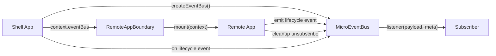

# 跨应用事件总线规范化

## 背景

Federlet 的 Shell 和 remote 通过 `MicroAppContext` 建立挂载协议。`eventBus` 是其中的可选能力，用于在不直接互相 import 的前提下传递跨应用事件。

这次规范化的目标是把事件总线从“基础 pub/sub”升级为“可治理通信协议”：

- 事件名有统一格式，避免随意字符串扩散。
- 内置事件有 payload 类型约束。
- 运行时可以校验 payload，防止动态配置绕过 TypeScript。
- 事件派发带有 `source`、`traceId`、`timestamp` 等 meta，便于调试和审计。
- remote 订阅必须在卸载时释放，避免路由切换后残留监听器。

## 事件模型

事件名采用严格三段式：

```text
domain.topic.action
```

示例：

- `remote.lifecycle.mounted`
- `remote.lifecycle.unmounted`
- `auth.session.updated`

内置事件在 `packages/shared-types/src/index.ts` 的 `FederletEventMap` 中声明。业务侧仍可使用自定义三段式事件名，但自定义事件的 payload 在类型层默认为 `unknown`，需要消费方自行收窄或通过运行时 validator 校验。

## 数据流



## 类型契约

核心类型位于 `packages/shared-types/src/index.ts`：

- `FederletEventMap`：内置事件名到 payload 的映射。
- `FederletEventName`：内置事件名联合类型。
- `FederletEventMeta`：事件 meta，包含 `source`、`traceId`、`timestamp`。
- `MicroEventBus`：对外事件总线接口。

`MicroEventBus` 的事件名参数使用 `FederletEventName | (string & {})`。这样 IDE 会提示内置事件名，同时仍允许业务自定义事件。

## 运行时实现

实现位于 `packages/mf-runtime/src/event-bus.ts`。

对外 API 保持：

```ts
eventBus.emit(eventName, payload, meta);
const unsubscribe = eventBus.on(eventName, (payload, meta) => {});
```

内部 transport 使用 `mitt`，但 `mitt` 只作为实现细节。对外仍保持 Federlet 自己的治理协议：

- `emit()` 先校验事件名。
- 如果配置了 `validatePayload`，继续校验 payload。
- 派发前补齐 `meta.timestamp`。
- listener 接收 `(payload, meta)`，而不是 mitt 的单参数事件对象。
- 成功派发后触发 `onAuditEvent`。
- 非法事件在开发环境抛错，生产环境降级为 `console.warn`。

默认提供 `validateFederletEventPayload`，用于校验内置事件 payload。

## Shell 接入

Shell 应创建单例 event bus，并通过 `RemoteAppBoundary.createMountContext` 注入给所有 remote。

React Shell 示例位于 `apps/shell-react/src/App.tsx`：

```ts
const [eventBus] = useState<MicroEventBus>(() => createShellEventBus());
```

Vue Shell 示例位于 `apps/shell-vue/src/App.vue`：

```ts
const eventBus = createShellEventBus();
```

Shell 如果订阅事件，必须在组件卸载时调用 unsubscribe。例如 React Shell 使用 `useEffect` 订阅 remote 生命周期事件，并在 cleanup 中释放。

## Remote 接入

remote 应在框架实例挂载成功后再接入事件总线：

1. 订阅需要监听的事件。
2. 发布 `remote.lifecycle.mounted`。
3. 在 `unmount()` 中先释放订阅，再发布 `remote.lifecycle.unmounted`。
4. 无论 lifecycle 事件派发是否抛错，都要保证框架实例最终被清理。

为了保持 `mount()` 简洁，demo remote 把事件总线逻辑抽到了本地 helper：

- `apps/remote-react/src/remote-event-bus.ts`
- `apps/remote-vue/src/remote-event-bus.ts`
- `apps/remote-umi-react/src/remote-event-bus.ts`

`mount()` 只负责框架挂载、调用 `notifyMounted()`、返回 `unmount()`。

## 测试覆盖

当前覆盖包括：

- `packages/mf-runtime/test/runtime.test.ts`
  - 基础订阅和取消订阅。
  - 事件命名校验。
  - payload validator。
  - audit meta。
- `packages/shared-types/src/event-bus-types.test-d.ts`
  - 内置事件名提示类型。
  - 内置 payload 类型约束。
  - 自定义事件 payload 默认为 `unknown`。
- Shell 测试
  - React/Vue Shell 注入共享 `eventBus`。
  - `RemoteAppBoundary.createMountContext` 可透传 `eventBus`。
- Remote 测试
  - mount/unmount 生命周期事件。
  - 订阅释放。
  - mounted lifecycle 事件派发失败时释放订阅。
  - Vue/Umi 挂载失败时不误报 mounted。

## 边界与后续

- TypeScript 只能约束静态字面量事件名。来自运行时配置的 `string` 事件名需要依赖 `validatePayload` 做运行时兜底。
- React 19 的渲染期异常可能发生在 `mount()` 返回之后，属于全局错误边界能力范围，不由事件总线生命周期协议单独解决。
- 事件总线不应替代共享状态管理。跨应用事件适合表达“发生了什么”，不适合承载长期业务状态。
- 当前 audit 只提供 hook，不负责持久化或上报监控平台。
