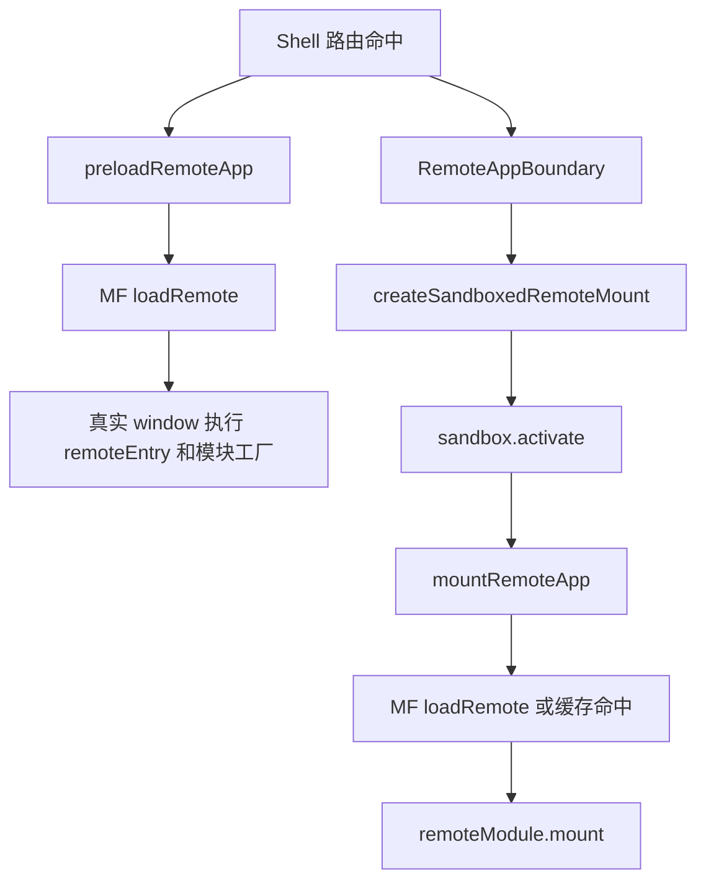

# 执行上下文 Proxy 化可行性评估

## 结论

在当前 Federlet 架构下，执行上下文 Proxy 化可以作为中期实验方向推进，但不适合直接作为默认生产沙箱能力。

当前 `@federlet/sandbox` 已经具备 proxy global、副作用追踪和生命周期清理能力；问题不在于能否创建 proxy，而在于 Module Federation remote 代码是否能在首次执行前稳定拿到这个 proxy。Federlet 目前通过 `@module-federation/enhanced/runtime` 的 `loadRemote()` 加载 remote，Shell 并没有直接接管 remoteEntry、exposed module factory 和 async chunk 的 fetch/eval。React Shell 还会在 `RemoteAppBoundary` 挂载前执行 `preloadRemoteApp()`，这会让 remoteEntry 和 exposed module top-level 代码提前在真实 `window` 下执行。

因此，Proxy 化不能只改 `packages/sandbox`。完整评估必须同时覆盖 `packages/mf-runtime` 的加载链路、Shell preload 策略、remote mount context 和平台 runtime global 保护。

## 当前链路



关键代码位置：

- `packages/sandbox/src/index.ts`：`createFederletSandbox()` 创建 `proxyGlobal`，`createSandboxedRemoteMount()` 在调用 `mountRemote()` 前执行 `sandbox.activate()`。
- `packages/mf-runtime/src/loader.ts`：`defaultRemoteLoader()` 直接调用 `loadRemote()`；`preloadRemoteApp()` 只加载并校验 exposed module，不执行 `mount()`；`mountRemoteApp()` 先加载模块再调用 `remoteModule.mount(context)`。
- `packages/react-shell/src/index.tsx` 和 `packages/vue-shell/src/index.ts`：Shell boundary 通过 `createSandboxedRemoteMount()` 包住 `mountRemoteApp()`。
- `apps/shell-react/src/App.tsx`：`PreloadedRemoteRoute` 会在真正渲染 `RemoteAppBoundary` 前调用 `preloadRoute(route)`。
- `packages/shared-types/src/index.ts`：`MicroAppContext` 当前只包含 `basename`、`container`、`props`、`eventBus`、`onError`，没有 sandbox global 字段。

这说明当前激活点可以治理 mount 期间的 timer、listener 和 global handler，但不能保证 remoteEntry、模块顶层代码和 preload 期间的 direct `window` 写入进入 proxy。

## 可行路线

### 1. 显式上下文注入

先扩展 `MicroAppContext`，增加可选 sandbox 能力，例如：

```ts
interface MicroAppContext {
  sandbox?: {
    globalThis: Window;
    remoteName: string;
  };
}
```

Shell 在创建 remote mount context 后，把 `sandbox.globalThis` 注入给愿意配合的 remote。remote 如果通过 `context.sandbox.globalThis.foo = "x"` 写入，污染会落到 sandbox target，而不进入真实 `window`。

这个方案不能拦截 `window.foo = "x"`，但接入成本低，可以验证 proxy API、浏览器 API fallback、`this` 绑定、诊断输出和清理模型。

### 2. sandbox-aware mount 包装

在 `packages/mf-runtime/src/loader.ts` 或 `packages/sandbox` 上层增加 sandbox-aware mount 入口：加载模块仍由 Module Federation runtime 完成，但调用 `remoteModule.mount(context)` 前明确激活 sandbox，并把 sandbox 能力注入 context。

这与当前 `createSandboxedRemoteMount()` 的能力接近，但接口边界会更清晰：`mf-runtime` 负责 remote 加载和 mount 协议，`sandbox` 负责 proxy global 和副作用归属。它能稳定覆盖 mount 阶段和业务运行阶段，仍不能覆盖已经被 preload 提前执行的模块顶层代码。

### 3. experimental proxy execution POC

新增实验开关，例如 manifest 或路由配置中的：

```ts
{
  sandbox: {
    experimentalProxyExecution: true,
    disablePreload: true
  }
}
```

开启后，目标 remote 走实验加载链路：

1. 禁用或延后该 remote 的 `preloadRemoteApp()`，避免 remote 在 sandbox 建立前被预加载。
2. 在调用 `loadRemote()` 前创建并激活 sandbox。
3. 继续让 `@module-federation/enhanced/runtime` 负责 remoteEntry、shared scope 和 async chunk。
4. 将 sandbox 能力注入 `MicroAppContext`。
5. 记录加载前后真实 `window` 上新增的 runtime key，只做诊断，不做全量删除。

这个 POC 的目标是验证“MF enhanced runtime 是否允许 Federlet 在 remote 首次执行前建立稳定的 sandbox 归属”。它不应重新抓取 remoteEntry 文本，也不应使用 `with(proxyWindow)` 或 `new Function` 重新执行 chunk。

## 必须保护的 runtime global

以下 key 由 Module Federation、Webpack/Rspack/Rsbuild/Vite、HMR 或 dev runtime 维护，不能迁入 remote 私有 proxy，也不能被清理逻辑误删：

- `__FEDERATION__`
- `webpackChunk*`
- `webpackHotUpdate*`
- `__webpack*`
- `remote_*`
- `chunk_*`

POC 期间可以记录这些 key 的出现时机，用来判断 remoteEntry、shared scope 和 async chunk 的执行阶段，但不能把它们当作 remote 业务污染处理。

## 不推荐方案

不建议直接接管 remoteEntry 或 chunk 文本并包裹执行：

```js
with (proxyWindow) {
  // remoteEntry 或 chunk 文本
}
```

也不建议用 `new Function` 手动重放 Module Federation chunk。

这样会绕开 `@module-federation/enhanced/runtime` 的 remote 注册、shared scope、缓存、错误恢复、source map、CSP 和 HMR 语义，容易引入 `RUNTIME-001`、`ChunkLoadError`、重复 React/Vue 实例或 dev runtime 状态错乱。

同样，不应把全量 `windowPropertySnapshotManager` 作为 Proxy 化失败后的兜底。它只能做卸载后补救，且已经确认存在误删 runtime global 的风险。

## POC 验证矩阵

### 单元验证

- `packages/sandbox/src/index.test.ts`：覆盖 `sandbox.globalThis` 写入不污染真实 `window`，`setTimeout`、`setInterval`、`requestAnimationFrame`、`addEventListener`、`onerror` 在 deactivate 后被清理。
- `packages/mf-runtime/src/loader-resilience.test.ts` 和 `packages/mf-runtime/test/runtime.test.ts`：覆盖 remote 加载失败、协议校验、重试、熔断和 runtime remote 注册行为不受 sandbox-aware loader 影响。
- `packages/react-shell/src/RemoteAppBoundary.test.tsx`、`packages/vue-shell/src/RemoteAppBoundary.test.ts`：覆盖 Shell boundary 能正常创建 mount context、挂载、卸载，并在异常时释放 sandbox。

### 集成验证

- React remote：进入、卸载、再次进入，确认 `remoteModule.mount(context)` 正常执行，卸载后 timer/listener 停止。
- Vue remote：同样验证挂载、卸载、再次进入，特别关注 async chunk 产生的 `chunk_*` key。
- preload 开启：确认文档化限制成立，即 preload 期间的模块顶层执行不受 mount sandbox 覆盖。
- preload 禁用：确认 sandbox 能在 `loadRemote()` 前激活，并记录 remoteEntry 加载期间新增的 runtime key。
- dev/HMR：确认 React Refresh、Vue HMR、Webpack/Rspack/Vite runtime key 不被隔离或删除。

### 失败判定

出现以下任一情况，实验能力不得默认启用：

- remoteEntry 加载失败或 exposed module exports 异常。
- `__FEDERATION__`、`webpackChunk*`、`chunk_*` 等 runtime key 被隔离到 remote proxy 后导致后续 chunk 无法加载。
- shared dependency 被重复实例化，例如 React/Vue 单例失效。
- HMR 或 dev runtime 状态错乱。
- 需要通过全量扫描并删除真实 `window` 属性才能维持稳定。

## 推荐落地顺序

1. 保持当前生产默认能力：生命周期副作用治理、DOM/head 检测与清理、remote key 命名规范、opt-in window key 清理。
2. 为 remote 增加可选 `context.sandbox.globalThis`，先服务可信 remote 和 demo 验证。
3. 将 preload 策略扩展为按 remote 可配置，为实验链路保留关闭 preload 的能力。
4. 做 sandbox-aware loader POC，只记录 runtime key，不删除真实 `window` 属性。
5. 完成 React/Vue remote、shared scope、async chunk、HMR 验证后，再决定是否扩大到生产灰度。

