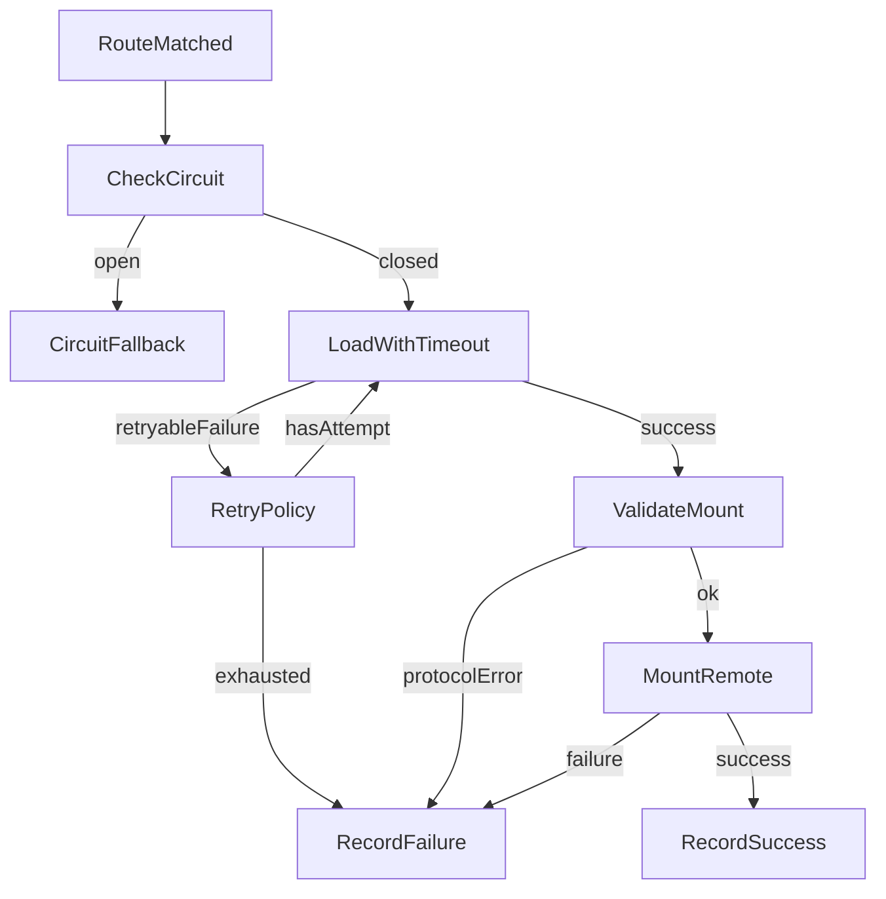

# Remote 加载韧性设计

## 目标

本设计覆盖 remote 加载超时、失败重试、熔断降级三个能力，目标是在 remote 网络异常、入口不可用或短时抖动时保护 Shell 主流程，避免页面长时间 loading 或反复触发无效加载。

## 加载阶段

Shell 加载 remote 的链路分为四段：

1. 动态注册 `remoteEntry.js`。
2. 通过 Module Federation runtime 加载暴露模块。
3. 校验暴露模块是否包含合法 `mount(context)`。
4. 调用 `mount(context)` 并拿到 `unmount()` 实例。

超时、重试、熔断主要作用在第 2 段和第 3 段。第 4 段的 mount 失败会记录失败并进入错误态，但不自动重试，避免业务副作用重复执行。

## 错误分类

- `remote-load-timeout`：加载暴露模块超过超时阈值。
- `remote-load-failed`：Module Federation runtime 加载失败。
- `remote-protocol-error`：remote 模块没有暴露合法 `mount`。
- `remote-mount-failed`：remote 的 `mount(context)` 执行失败。
- `remote-circuit-open`：remote 已被熔断，本次不发起真实加载。

其中 `remote-load-timeout` 和 `remote-load-failed` 默认可重试；协议错误、mount 错误、熔断错误不重试。

## 踩坑：Vite remoteEntry 必须按 module remote 注册

在 `pnpm dev:vite` 下，`shell-react` 动态加载 `remote-react` 或 `remote-vue` 时，如果控制台出现类似错误：

```text
Uncaught SyntaxError: Cannot use import statement outside a module
RUNTIME-001: Failed to get remoteEntry exports
RemoteEntryExports is undefined
```

优先检查 remote 注册信息是否携带或推导出了正确的 remoteEntry 加载格式。

Vite 产出的 `remoteEntry.js` 是 ESM，文件顶部会包含顶层 `import`。如果动态注册时只传：

```ts
registerRemotes([
  {
    name: "remote_react",
    entry: "http://localhost:3001/remoteEntry.js",
  },
]);
```

Module Federation runtime 会按默认 script/var remote 加载它，浏览器就会把 ESM 内容当普通脚本执行，最终表现为 remoteEntry 语法错误或 runtime 拿不到 remote exports。

如果某个环境明确只使用 Vite remote，可以在 Apollo manifest 中声明 remoteEntry 类型，并由 `@federlet/mf-runtime` 透传给 Module Federation runtime：

```ts
{
  remoteName: "remote_react",
  entryBaseUrl: "http://localhost:3001/",
  remoteEntryType: "module",
}
```

对于 Umi/Webpack var remote，则需要保留 var 加载格式和全局容器名：

```ts
{
  remoteName: "remote_umi_react",
  entryBaseUrl: "http://localhost:3003/",
  remoteEntryType: "var",
  entryGlobalName: "remote_umi_react",
}
```

但本地开发要注意：`dev:vite` 的 `remote-react` / `remote-vue` 是 ESM remote，`dev:rsbuild` / `dev:webpack` 的同名 remote 是 var remote。同一份本地 Apollo 配置不能把 `remoteEntryType: "module"` 写死，否则切到 Rsbuild/Webpack dev 模式时会用错误格式注册。

当前 Federlet 的约定是：

- manifest 显式传 `remoteEntryType` 时，以 manifest 为准。
- manifest 不传 `remoteEntryType` 时，`@federlet/mf-runtime` 会 fetch `remoteEntry.js` 做轻量探测；发现顶层 ESM `import` / `export` 时注册为 `type: "module"`，否则保持默认 var/script remote。
- Umi remote 可以继续声明 `entryGlobalName: "remote_umi_react"`，因为它的容器全局名不随 Shell 构建器变化。

排查顺序建议：

1. 直接访问 `http://localhost:<port>/remoteEntry.js`，确认响应是否是 ESM。若顶部有 `import ...`，必须按 `module` 注册。
2. 检查 Shell 注入的 manifest，避免把 React/Vue remote 的 `remoteEntryType` 硬编码成只适配某一种 dev builder。
3. 检查 `registerRuntimeRemoteEntries()` 是否探测或透传 `remoteEntryType`，并最终转成 Module Federation runtime 的 `type` 字段。
4. 对 Webpack/Umi remote，确认 `remoteEntryType: "var"` 和 `entryGlobalName` 与 Module Federation `name` 一致。

## 踩坑：Vue Shell 加载 Vite React remote 需要 React Refresh preamble

在 `pnpm dev:vite` 下，如果 Shell 是 `shell-vue`，加载 `remote-react` 时报错：

```text
@vitejs/plugin-react can't detect preamble. Something is wrong.
```

这不是 remote mount 协议问题，也不是 `remoteEntryType` 问题。Vite React remote 的 TSX 模块在 dev 模式下会被 `@vitejs/plugin-react` 注入 React Refresh 检测代码，例如：

```ts
if (import.meta.hot && !window.$RefreshReg$) {
  throw new Error("@vitejs/plugin-react can't detect preamble. Something is wrong.");
}
```

React Shell 通常会通过自身的 `@vitejs/plugin-react` 插件在 HTML 中安装 React Refresh preamble。但 Vue Shell 默认只注册 Vue 插件，不会安装 `window.$RefreshReg$`、`window.$RefreshSig$` 等 React Refresh 全局。于是 Vue Shell 加载 Vite React remote 的 TSX exposed module 时，就会在执行 remote 模块前直接抛错。

当前 Federlet 的处理约定是：`createVueHostConfig()` 在 Vite 模式下也注册 `react()` 插件，让 Vue Shell 具备消费 Vite React remote 所需的 React Refresh preamble：

```ts
export function createVueHostConfig(options: HostConfigOptions): UserConfig {
  const config = createBaseConfig(options, "vue");

  return defineConfig({
    ...config,
    plugins: [
      react(),
      ...(config.plugins ?? []),
      federation(/* ... */),
    ],
  });
}
```

排查顺序建议：

1. 直接访问 `http://localhost:3001/src/App.tsx` 这类 Vite React remote TSX 模块，确认是否包含 `@vitejs/plugin-react can't detect preamble` 检测代码。
2. 检查当前 Shell 是否是非 React Shell；如果是 Vue Shell，需要确认 Vite 插件链里是否包含 `@vitejs/plugin-react`。
3. 修改 Vite 插件配置后必须重启 `pnpm dev:vite`，HTML preamble 和插件链变更不能依赖热更新生效。

## 踩坑：Rsbuild remote 异步 chunk 必须从 remote 源加载

在 `pnpm dev:rsbuild` 下，如果 remote 内部路由仍然使用动态 `import()`，Shell 加载 remote 后可能出现：

```text
ChunkLoadError: Loading chunk src_xxx failed
```

或 Network 面板里看到 async chunk 请求打到了 Shell 端口，而不是 remote 端口。

这通常不是 remote 内部异步路由本身的问题。Federlet 需要支持 remote 自己的异步页面；不能通过把 remote 路由改成 eager import 来规避。

Rsbuild dev 下 remote 的静态资源 public path 需要明确指向 remote 自身，否则 exposed module 加载后，后续 async chunk 可能按当前页面地址解析。当前约定是 remote config 开启：

```ts
dev: {
  assetPrefix: true,
}
```

排查顺序建议：

1. 打开 Network 面板，检查失败的 chunk URL 是否来自 remote 端口。
2. 检查 `createReactRemoteConfig()` 和 `createVueRemoteConfig()` 是否都保留了 `dev.assetPrefix: true`。
3. 保留 remote 内部动态 `import()`，优先修 asset public path，不要把异步路由降级成同步路由。

## 踩坑：Vue feature flags 和 SFC HMR 需要按构建器显式处理

Vue remote 在 Webpack/Rspack/Rsbuild dev 模式下，如果控制台出现类似：

```text
ReferenceError: __VUE_OPTIONS_API__ is not defined
ReferenceError: __VUE_HMR_RUNTIME__ is not defined
```

优先检查 Vue 编译期 feature flags 和 Vue SFC HMR 配置。

Vue 运行时代码依赖这些编译期常量被构建器替换：

- `__VUE_OPTIONS_API__`
- `__VUE_PROD_DEVTOOLS__`
- `__VUE_PROD_HYDRATION_MISMATCH_DETAILS__`

Webpack/Rspack 需要通过 `DefinePlugin` 定义这些值。Vite/Rsbuild 也要确保对应配置没有遗漏。

另一个容易混淆的点是 `vue-loader` / `rspack-vue-loader` 的 SFC HMR。remote 被 Shell 以 Module Federation 方式加载时，SFC HMR 的全局运行时不一定属于同一个应用边界。对于 Federlet 的示例 remote，当前约定是禁用 Vue SFC hot reload：

```ts
pluginVue({
  vueLoaderOptions: {
    hotReload: false,
  },
})
```

Webpack/Rspack 的 `vue-loader` 同理需要设置：

```ts
{
  loader: "vue-loader",
  options: {
    hotReload: false,
  },
}
```

## 踩坑：shell-vue 加载 remote-vue 时可能发生 Vue HMR id 冲突

`pnpm dev:rsbuild` 下，如果 Shell 是 `shell-vue`，加载 `remote-vue` 后页面变成只有 remote 内容，Shell 侧边栏和布局消失，且 remote 样式看起来也没生效，优先检查 Vue SFC HMR。

这类现象容易误判成 mouseover preload、Vue Router 或 CSS 隔离问题。实际根因可能是：Shell 和 remote 都是 Vue SFC，并且文件路径相似时，`rspack-vue-loader` 生成了相同的 HMR id。例如两个应用的 `App.vue` 都生成：

```text
__hmrId = "7a7a37b1"
```

加载 remote exposed module 时，remote 的 SFC HMR 代码会访问全局 `__VUE_HMR_RUNTIME__`，并对同一个 HMR id 调用 `createRecord()` / `reload()`。如果这个 id 已经被 shell 的 `App.vue` 占用，remote 组件记录可能覆盖 shell 根组件记录，表现为 shell 根组件被替换成 remote 组件。

样式“没生效”的原因通常是 remote CSS 已经被 Federlet 前缀化，例如：

```css
.federlet-scope-remote-vue .vue-remote {
  /* remote styles */
}
```

但被错误替换到 `#root` 的 remote DOM 不在 `.federlet-scope-remote-vue` 容器里，所以前缀样式匹配不到。

处理建议：

1. 不要通过移除 `mouseenter` 预加载来掩盖问题；真正导航加载 remote 仍会触发同类冲突。
2. 禁用 Rsbuild Vue SFC hot reload：`pluginVue({ vueLoaderOptions: { hotReload: false } })`。
3. 重启 `pnpm dev:rsbuild`，构建配置变更不会可靠地热更新到已有 dev server。
4. 验证新产物的 Shell/remote chunk 中不再出现 remote SFC 的 `__VUE_HMR_RUNTIME__` 记录冲突。

## 踩坑：window 快照恢复不能误删平台运行时全局

`windowPropertySnapshotManager` 的目标是治理 remote 直接写入的 `window.foo = ...`。但 Module Federation、Webpack、Rspack、Rsbuild 也会在 `window` / `self` 上维护运行时全局。如果快照恢复在 remote 卸载时把这些全局删掉，会破坏后续 remote 加载。

典型现象包括：

```text
ChunkLoadError
RUNTIME-001: Failed to get remoteEntry exports
remoteEntry exports is undefined
```

也可能表现为第一次切换 remote 报错、刷新后恢复正常。

需要保护的运行时全局至少包括：

- `__FEDERATION__`
- `webpackChunk*`
- `webpackHotUpdate*`
- `__webpack*`
- `remote_*`
- `chunk_*`

其中 `chunk_*` 是 Rsbuild/Rspack JSONP async chunk 运行时常见全局，例如 `chunk_remote_vue`。如果这个数组被 sandbox 快照恢复删除，后续异步 chunk callback 可能无法正确注册或执行。

排查顺序建议：

1. 在报错前后检查 `window.chunk_<remoteName>`、`window.webpackChunk*`、`window.__FEDERATION__` 是否被删除或恢复成旧值。
2. 临时禁用 window 快照恢复可以用来确认根因，但不应作为长期方案。
3. 长期方案应把平台运行时全局纳入保护名单，或把直接 `window.foo = ...` 的治理收敛到更明确的 remote 自有 key 空间，避免和 bundler/runtime 全局争用。

## 默认策略

- 加载超时：`8000ms`。
- 自动重试：最多 `3` 次总尝试，即初次加载 + `2` 次重试。
- 退避策略：指数退避，默认 `300ms -> 600ms`。
- 熔断阈值：同一 remote 连续失败 `3` 次后打开熔断。
- 熔断冷却：`30000ms` 后允许再次尝试。

## 熔断状态

最小实现采用浏览器内存级状态，不做跨 tab 同步，也不持久化。



## Shell 展示

- 自动重试期间保持 loading。
- 重试耗尽后进入错误态，并保留手动 Retry。
- 熔断期间直接进入错误态，不再真实加载 remote。
- 错误文案应区分超时、重试耗尽和熔断，便于用户和开发者理解。

## 非目标

- 不做服务端熔断。
- 不做跨浏览器 tab 共享状态。
- 不接入监控系统，只保留错误 code 和 console 诊断。
