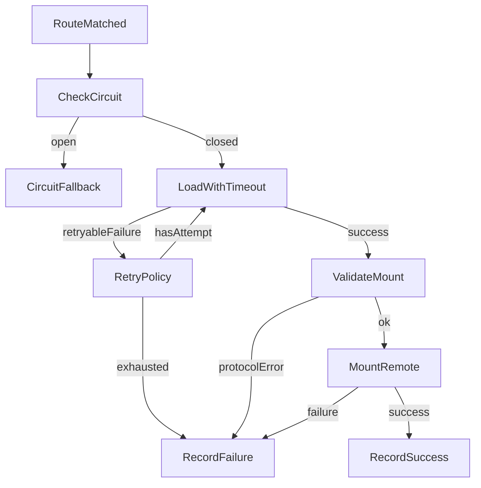

# Remote 加载韧性设计

## 目标

本设计覆盖 remote 加载超时、失败重试、熔断降级三个能力，目标是在 remote 网络异常、入口不可用或短时抖动时保护 Shell 主流程，避免页面长时间 loading 或反复触发无效加载。

## 加载阶段

Shell 加载 remote 的链路分为四段：

1. 动态注册 `remoteEntry.js`。
2. 通过 Module Federation runtime 加载暴露模块。
3. 校验暴露模块是否包含合法 `mount(context)`。
4. 调用 `mount(context)` 并拿到 `unmount()` 实例。

超时、重试、熔断主要作用在第 2 段和第 3 段。第 4 段的 mount 失败会记录失败并进入错误态，但不自动重试，避免业务副作用重复执行。

## 错误分类

- `remote-load-timeout`：加载暴露模块超过超时阈值。
- `remote-load-failed`：Module Federation runtime 加载失败。
- `remote-protocol-error`：remote 模块没有暴露合法 `mount`。
- `remote-mount-failed`：remote 的 `mount(context)` 执行失败。
- `remote-circuit-open`：remote 已被熔断，本次不发起真实加载。

其中 `remote-load-timeout` 和 `remote-load-failed` 默认可重试；协议错误、mount 错误、熔断错误不重试。

## 默认策略

- 加载超时：`8000ms`。
- 自动重试：最多 `3` 次总尝试，即初次加载 + `2` 次重试。
- 退避策略：指数退避，默认 `300ms -> 600ms`。
- 熔断阈值：同一 remote 连续失败 `3` 次后打开熔断。
- 熔断冷却：`30000ms` 后允许再次尝试。

## 熔断状态

最小实现采用浏览器内存级状态，不做跨 tab 同步，也不持久化。

## Shell 展示

- 自动重试期间保持 loading。
- 重试耗尽后进入错误态，并保留手动 Retry。
- 熔断期间直接进入错误态，不再真实加载 remote。
- 错误文案应区分超时、重试耗尽和熔断，便于用户和开发者理解。

## 非目标

- 不做服务端熔断。
- 不做跨浏览器 tab 共享状态。
- 不接入监控系统，只保留错误 code 和 console 诊断。
