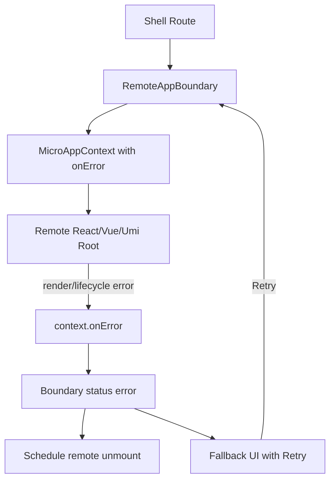

# Remote Render Error Boundary

## 背景

Federlet 的 Shell 通过 `RemoteAppBoundary` 加载并挂载 remote。加载、超时、熔断和 mount 失败都发生在 Shell 可直接控制的调用链里，因此可以由 Shell 统一捕获并展示错误态。

remote 渲染期异常不同。React、Vue、Umi remote 都会在 Shell 提供的 DOM 容器内创建各自独立的框架 root。Shell 外层的 React ErrorBoundary 只能捕获 Shell 自己这棵 React 树中的异常，不能捕获 remote 独立 root 后续发生的 render 或 lifecycle error。

因此，全局 remote 错误边界采用“协议回调 + Shell 局部降级”的方式实现：Shell 在 `MicroAppContext` 中注入 `onError`，remote 在各自框架 root 内捕获运行期异常并主动回传给 Shell。

## 目标

- remote 渲染异常不拖垮 Shell 主框架。
- 单个 remote 崩溃时只降级该 remote 区域，Shell 导航和其他 remote 继续可用。
- 加载失败、mount 失败、渲染期失败复用统一的错误态和 Retry 入口。
- 错误保留 route 和 remote 维度上下文，便于后续接入监控平台。

## 类型契约

核心协议位于 `packages/shared-types/src/index.ts`：

```ts
export interface MicroAppContext {
  basename: string;
  container: HTMLElement;
  props?: Record<string, unknown>;
  eventBus?: MicroEventBus;
  onError?: (error: unknown) => void;
}
```

`onError` 是可选能力。已有 remote 不实现时仍可正常挂载，但无法把独立 root 内的运行期异常回传给 Shell。新接入的 remote 应在框架级错误处理器中调用 `context.onError?.(error)`。

## 数据流



## Shell 行为

`packages/react-shell/src/index.tsx` 中的 `useRemoteAppMount` 会把 Shell 的错误处理器合并进 mount context：

- remote 调用 `context.onError(error)` 后，`RemoteAppBoundary` 将当前 remote 状态切换为 `error`。
- 默认 fallback 展示用户友好的 `errorMessage`，并在 `Technical details` 中展示完整错误链。业务也可以通过 `renderError` 自定义展示。
- `onError(error, route)` 和 `onStatusChange("error", route)` 保留 route 上下文。
- 已挂载的 remote 实例会被调度 `unmount()`，释放框架 root、事件订阅和副作用。
- 点击 Retry 会通过现有 `retryKey` 重新执行加载和 mount。

Shell React App 在 `apps/shell-react/src/App.tsx` 中创建 mount context，并注入 route 维度日志：

```ts
onError(error: unknown) {
  console.error(`Remote runtime error from ${route.id}`, error);
}
```

## 错误详情展示

默认 UI 会同时保留两层信息：

- `errorMessage`：给用户看的稳定降级文案，例如 `Remote app failed during mount.`。
- `errorDetails`：给开发者看的技术详情，递归展开 `name`、`message`、`code`、`remoteName`、`stack` 和 `cause`。

`RemoteAppBoundaryRenderState` 会把 `errorDetails` 传给自定义 `renderError`：

```ts
export interface RemoteAppBoundaryRenderState {
  error: unknown;
  errorDetails: RemoteErrorDetails;
  errorMessage: string;
  retry: () => void;
  route: RemoteRouteConfig;
  status: RemoteAppStatus;
}
```

React Shell 和 Vue Shell 的默认 fallback 都会渲染：

```html
<details>
  <summary>Technical details</summary>
  <pre>...</pre>
</details>
```

如果 DevTools 中的错误是：

```text
RemoteLoadError: Remote remote_vue/mount failed during mount.
Caused by: ReferenceError: b is not defined
```

UI 的 technical details 会同步展示为：

```text
RemoteLoadError: Remote remote_vue/mount failed during mount.
Code: remote-mount-failed
Remote: remote_vue

Stack:
...

Caused by:
ReferenceError: b is not defined

Stack:
...
```

这样既不会破坏普通用户的错误文案，也能让开发期 UI 与 DevTools 中的错误链保持一致。

## Remote 接入

### React 19 Remote

`apps/remote-react/src/mount.tsx` 使用 React 19 root 级错误回调：

```ts
createRoot(context.container, {
  onCaughtError(error) {
    context.onError?.(error);
  },
  onUncaughtError(error) {
    context.onError?.(error);
  },
});
```

这类错误属于 remote 独立 React root 的运行期 render/lifecycle 异常，会回传给 Shell 并触发局部降级。

### Vue Remote

`apps/remote-vue/src/mount.ts` 使用 Vue runtime error handler：

```ts
app.config.errorHandler = (error) => {
  context.onError?.(error);

  if (isMounting) {
    throw error;
  }
};
```

`isMounting` 用于区分初始 mount 阶段和已挂载后的运行期。初始 mount 失败仍继续抛出，让 Shell 按 mount 失败处理；已挂载后的运行期异常则通过 `onError` 进入 remote 局部降级。

### Umi / React 17 Remote

`apps/remote-umi-react/src/mount.tsx` 在 remote 内部增加本地 class ErrorBoundary：

```tsx
class RemoteRuntimeErrorBoundary extends React.Component<RemoteRuntimeErrorBoundaryProps> {
  componentDidCatch(error: unknown) {
    this.props.onError(error);

    if (this.props.shouldRethrow()) {
      this.props.onMountError(error);
    }
  }

  render() {
    return this.props.children;
  }
}
```

React 17 没有 React 19 的 root error callbacks，因此通过本地 ErrorBoundary 捕获 render/lifecycle error。初始 mount 阶段捕获到的错误会被带回 `mount()` 并重新抛出，避免错误 remote 继续发出 mounted 生命周期事件。

## 错误分类

Shell 侧错误态主要分为两类：

- mount 前后调用链错误：remoteEntry 加载失败、协议不兼容、mount 函数抛错、加载超时、熔断打开。这些由 `@federlet/mf-runtime` 包装为 `RemoteLoadError`，并带有 `RemoteLoadErrorCode`。
- remote 运行期错误：remote 独立 root 在 render 或 lifecycle 中抛错，remote 通过 `context.onError` 主动上报给 `RemoteAppBoundary`。

如果错误发生在 remote `mount()` 函数体内、框架 root 真正运行前，例如：

```ts
console.log(a, "a");
```

这仍然是 mount 阶段异常。`mountRemoteApp()` 会把原始 `ReferenceError: a is not defined` 包装为 `RemoteLoadErrorCode.MountFailed`，顶层错误消息会显示为 `Remote ... failed during mount.`，原始错误保存在 `cause` 上。

## 降级策略

- 加载或 mount 失败：展示对应错误文案，例如 `Remote app failed during mount.`。
- remote 运行期异常：展示默认运行期错误文案、technical details 或业务自定义 fallback。
- Retry：重新加载并 mount 当前 remote。
- Unmount：进入运行期错误态时，Shell 会调度当前 remote 实例 `unmount()`，避免错误 root 和副作用残留。

## 测试覆盖

当前覆盖包括：

- `packages/react-shell/src/RemoteAppBoundary.test.tsx`：remote 调用 `context.onError` 后展示 fallback、调用 Shell `onError`、切换 `error` 状态并卸载实例。
- `packages/react-shell/src/RemoteAppBoundary.test.tsx`：默认错误 UI 展示 `RemoteLoadError` 和原始 `cause` 错误链。
- `packages/vue-shell/src/RemoteAppBoundary.test.ts`：默认错误 UI 展示 `RemoteLoadError` 和原始 `cause` 错误链。
- `apps/shell-react/src/App.test.tsx`：Shell 创建 mount context 时注入 `onError`。
- `apps/remote-react/src/mount.runtime-error.test.tsx`：React 19 root error callbacks 转发到 `context.onError`。
- `apps/remote-vue/src/mount.runtime-error.test.ts`：Vue `app.config.errorHandler` 转发运行期错误。
- `apps/remote-umi-react/src/mount.runtime-error.test.tsx`：React 17 本地 ErrorBoundary 转发运行期错误。
- 既有 mount failure 测试：确保初始 mount 失败仍走 mount 失败路径，不误发 mounted 生命周期事件。

建议验证命令：

```bash
pnpm --filter @federlet/react-shell test -- RemoteAppBoundary.test.tsx
pnpm --filter @federlet/vue-shell test -- RemoteAppBoundary.test.ts
pnpm --filter shell-react test -- App.test.tsx
pnpm --filter remote-react test -- mount.runtime-error.test.tsx
pnpm --filter remote-vue test -- mount.runtime-error.test.ts
pnpm --filter remote-umi-react test -- mount.runtime-error.test.tsx
pnpm typecheck
pnpm test
```

## 后续增强

- 接入 Sentry 或其他监控平台，按 `remoteName`、route id、用户、租户和 trace 聚合错误。
- 在 remote 接入 checklist 中明确要求：非 React/Vue/Umi remote 必须把框架级运行期异常转发到 `context.onError`。
- 增加 E2E 场景：注入 remote render error，验证仅当前 remote 区域降级，Shell 导航仍可使用。
