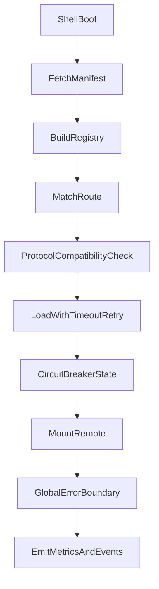

# 阶段三：运行时治理方案（总文档）

## 背景与范围

本文件对应 `ROADMAP.md` 中“阶段三：运行时治理”的 11 个条目，目标是把当前“可运行”的微前端壳应用演进到“可治理、可观测、可回滚”的运行时体系。

文档只覆盖运行时治理能力，不包含样式/沙箱安全（阶段四）和平台化发布（阶段六）的完整实现细节。

## 现状基线

当前代码中，Shell 与 remote 的集成基于以下稳定事实：

- Shell 使用静态路由表：`apps/shell-react/src/remote-routes.ts`。
- remote 加载通过 `mountRemoteApp` 完成：`packages/mf-runtime/src/loader.ts`。
- 协议核心类型位于 `packages/shared-types/src/index.ts`（`MicroAppContext`、`MicroAppInstance`、`RemoteRouteConfig`）。
- 跨应用事件通信已有轻量能力：`packages/mf-runtime/src/event-bus.ts`。
- Shell 的加载/失败展示集中在 `apps/shell-react/src/RemoteAppBoundary.tsx`。

阶段三所有设计都以这些现有边界为衔接点，尽量增量演进，不做破坏式重构。

## 术语

- **Manifest**：环境下发的 remote 声明清单，提供入口、版本、状态与策略元数据。
- **Registry**：Shell 内部标准化注册中心，负责把 manifest 转换成可路由、可加载的数据结构。
- **协议版本**：Shell 与 remote 在 `mount(context)` 契约层面的兼容标识。
- **熔断**：remote 连续失败时临时停止真实加载，直接走降级路径。
- **降级**：remote 不可用时，Shell 显示兜底 UI 或替代能力。

## 设计原则

- **向后兼容**：先兼容静态 `remote-routes`，再平滑切换动态配置。
- **失败优先**：对超时、网络失败、模块不合法、运行时异常都给出明确处理。
- **策略可配置**：超时、重试、熔断阈值、预加载名单均可按环境调整。
- **渐进启用**：每项能力支持 feature flag，避免一次性切流风险。
- **可观测**：关键阶段均产生日志/指标/事件，便于定位问题和评估收益。

## 运行时主流程

## 统一章节模板（用于 11 项）

每项方案都包含：

1. 目标与当前问题
2. 方案设计（数据结构/接口/状态机）
3. 与现有代码衔接点
4. 分阶段落地步骤（MVP -> 增强）
5. 失败场景与降级策略
6. 验收标准
7. 建议测试

---

## 1) 动态 Remote Manifest（Shell 不再写死 remoteEntry）

### 目标与当前问题

- 目标：Shell 启动时从远端获取 remote 声明，而不是把地址硬编码在构建配置/路由文件。
- 问题：当前 `remote-routes.ts` 是静态配置，变更 remote 地址需重新发版 Shell。

### 方案设计

- 明确 manifest 来源为 **Apollo 配置中心**，并采用“流水线打包注入 Shell 全局环境变量”的交付模式：
  - Apollo 维护当前集群的 remote manifest JSON。
  - CI/CD 在构建阶段读取 Apollo 配置，并注入到 Shell 全局环境变量（如 `window.__FEDERLET_ENV__.manifest`）。
  - Shell 启动时直接读取已注入的 manifest，不再额外请求 manifest URL。
- 定义 manifest 契约（建议 JSON）：
  - `remotes[]`（`id`、`remoteName`、`entryBaseUrl`、`basename`、`status`、`meta`）
- Shell 启动阶段新增 `fetchRuntimeManifest()`，并做 schema 校验。
- 校验通过后转换为内部 `RuntimeRemoteDefinition`，再交给 registry。

### 与现有代码衔接点

- `apps/shell-react/src/remote-routes.ts`：保留为 fallback 静态配置。
- `packages/mf-runtime/src/loader.ts`：后续读取 registry 中的动态入口元数据。
- `packages/shared-types/src/index.ts`：新增 manifest 与 registry 相关类型定义。

### 分阶段落地步骤

- MVP：manifest URL 由 Apollo -> CI 注入到 Shell 全局环境变量；启动时按该 URL 拉取 manifest；失败时回退静态路由。
- 增强：支持签名校验、ETag 协商、manifest 版本兼容校验。

### 失败场景与降级策略

- manifest 请求失败：回退静态路由并上报 `manifest_fetch_failed`。
- manifest 校验失败：忽略动态配置，继续使用已知稳定配置。

### 验收标准

- 不改 Shell 构建产物即可更新 remote 入口。
- manifest 异常不会导致 Shell 整体不可用。

### 建议测试

- 单测：manifest schema 校验与转换器。
- 集成：模拟 manifest 成功/失败/非法内容。
- E2E：切换 manifest 中某个 remote 地址并验证生效。

---

## 2) 环境化 Remote 地址（本地/测试/预发/生产独立配置）

### 目标与当前问题

- 目标：不同环境读取各自 manifest 或入口映射，避免跨环境误连。
- 问题：目前 remote 地址耦合在开发期配置，环境边界不清晰。

### 方案设计

- 约定 `runtimeEnv`（`local`/`test`/`staging`/`prod`）。
- Apollo 按环境维护 `runtimeEnv -> manifestUrl` 映射。
- CI/CD 在打包时将对应环境配置注入 Shell 全局环境变量（例如：
  - `window.__FEDERLET_ENV__.runtimeEnv`
  - `window.__FEDERLET_ENV__.manifestUrl`）。
- manifest 内可继续包含 `environments` 字段，支持环境内覆盖。

### 与现有代码衔接点

- `apps/shell-react` 启动入口读取全局环境变量中的 `runtimeEnv` 与 `manifestUrl`。
- `packages/shared-types/src/index.ts` 新增 `RuntimeEnvironment` 联合类型。

### 分阶段落地步骤

- MVP：按环境选择不同 manifest URL。
- 增强：支持按租户/region 二级环境映射。

### 失败场景与降级策略

- 未识别环境：默认回退到 `test` 或明确中断（可配置）。
- Apollo 配置未注入或注入字段缺失：输出可诊断错误并回退静态路由。
- Apollo 配置与构建环境不一致：记录 `env_mismatch` 事件并阻断动态清单启用（可配置）。

### 验收标准

- 同一 Shell 制品在不同环境可加载不同 remote 地址。
- 日志中可明确看到最终生效的环境、Apollo 配置版本和 manifest 来源。

### 建议测试

- 单测：环境选择器。
- 集成：四类环境映射回归。
- E2E：不同环境启动验证 remote 指向差异。

---

## 3) Remote 版本治理（Shell 与 remote 协议兼容）

### 目标与当前问题

- 目标：在加载前校验协议兼容，避免 runtime 才暴露不兼容错误。
- 问题：当前仅校验是否有 `mount` 函数，缺少协议级版本协商。

### 方案设计

- 协议版本不是 `remoteEntry` 的构建版本，而是 Shell 与 remote 的生命周期/上下文契约版本。
- Shell 声明当前支持的 remote 挂载协议版本，例如：
  - `SHELL_REMOTE_PROTOCOL_VERSION = "1"`
- remote 在 Apollo manifest 中声明自己兼容的 Shell 协议版本，例如：
  - `supportedShellProtocolVersions: ["1"]`
- Shell 加载 manifest 时先做兼容性过滤：
  - 匹配：注册 remoteEntry，并生成 route。
  - 不匹配：跳过该 remote，不注册、不挂载，并输出诊断。

协议版本保护的是 `mount(context)` 契约，例如：

- Shell 注入的 `basename`、`container`、`props`、`eventBus` 字段是否符合 remote 预期。
- remote 返回的实例是否至少支持 `unmount()`。
- 后续如果 Shell 增加权限、用户上下文、租户上下文、预加载或健康检查等协议字段，可以通过协议版本避免旧 remote 被强行挂载。

它和资源版本的边界：

- `remoteEntry.js` 缓存策略解决“加载哪个构建产物”。
- 协议版本解决“Shell 和 remote 是否按同一套契约通信”。

### 与现有代码衔接点

- `apps/shell-react/src/config/constants.ts`：维护 `SHELL_REMOTE_PROTOCOL_VERSION`。
- `apps/shell-react/src/config/apollo.ts`：每个 remote 声明 `supportedShellProtocolVersions`。
- `apps/shell-react/src/runtime-manifest.ts`：加载 manifest 时过滤不兼容 remote。
- `packages/shared-types/src/index.ts`：`RuntimeRemoteManifestItem` 定义协议兼容字段。

### 分阶段落地步骤

- MVP：支持精确匹配（例如 Shell 为 `"1"`，remote 声明 `["1"]`）。
- 增强：支持 semver range 与灰度规则。

### 失败场景与降级策略

- 版本不兼容：不尝试加载 remote，直接显示“版本不兼容”降级页。

### 验收标准

- 不兼容 remote 不进入真实加载阶段。
- 兼容拒绝原因可被日志与监控检索。

### 建议测试

- 单测：兼容判定矩阵。
- 集成：manifest 中兼容/不兼容组合。
- E2E：模拟 shell 升级后的兼容回归。

---

## 4) Remote 注册中心（名称、入口、版本、路由、状态集中维护）

### 目标与当前问题

- 目标：引入统一 registry 作为运行时单一事实来源（SSOT）。
- 问题：当前路由、加载、状态分散在多个组件与配置中。

### 方案设计

- 建立 `RuntimeRemoteRegistry`：
  - `registerMany(definitions)`
  - `getByRoute(pathname)`
  - `getByName(remoteName)`
  - `updateHealth(remoteName, status, reason)`
- registry 内记录：
  - 路由元信息
  - 当前健康状态
  - 最近失败时间/次数
  - 预加载与缓存策略

### 与现有代码衔接点

- `apps/shell-react/src/remote-routes.ts` 由“配置源”转为“fallback seed”。
- `RemoteAppBoundary` 改为从 registry 获取当前 route 的 runtime 定义。

### 分阶段落地步骤

- MVP：只支持静态初始化 + 按 `remoteName` 查询。
- 增强：支持运行时热更新、状态订阅与调试面板输出。

### 失败场景与降级策略

- registry 初始化失败：拒绝动态能力并回退静态加载。

### 验收标准

- Shell 内所有 remote 元数据都可通过 registry 查询。
- 业务代码不再直接读取散落配置。

### 建议测试

- 单测：增删改查与状态更新逻辑。
- 集成：manifest -> registry 构建链路。

---

## 5) Remote 加载超时控制

详细设计见 `docs/remote-load-resilience.md`。

### 目标与当前问题

- 目标：为 remote 加载设置上限，避免无限等待导致页面卡死。
- 问题：`mountRemoteApp` 当前缺少显式超时机制。

### 方案设计

- `loadWithTimeout(promise, timeoutMs, timeoutCode)` 包装加载过程。
- timeout 配置分层：
  - 全局默认（如 8s）
  - remote 级覆盖（manifest 指定）
- 超时后标记一次失败，交给重试/熔断策略处理。

### 与现有代码衔接点

- `packages/mf-runtime/src/loader.ts` 的 `defaultRemoteLoader` 外层增加 timeout 包装。
- `apps/shell-react/src/RemoteAppBoundary.tsx` 根据超时错误码展示可理解文案。

### 分阶段落地步骤

- MVP：固定超时 + 错误类型区分。
- 增强：按网络质量动态调整超时阈值。

### 失败场景与降级策略

- 超时：提示“加载超时，请重试”，并提供重试按钮。

### 验收标准

- 远端无响应时，用户在超时阈值后必定看到可操作反馈。

### 建议测试

- 单测：timeout wrapper。
- 集成：模拟慢响应 remote。
- E2E：验证超时后 UI 状态和按钮行为。

---

## 6) Remote 加载失败重试策略

详细设计见 `docs/remote-load-resilience.md`。

### 目标与当前问题

- 目标：对短暂网络抖动自动恢复，减少用户手工刷新。
- 问题：目前仅有手动 Retry，且无统一重试策略。

### 方案设计

- 定义重试策略：
  - `maxAttempts`
  - `backoffBaseMs`
  - `backoffMode`（线性/指数）
  - `jitter`
- 对可重试错误（网络、超时、5xx）自动重试；协议错误不重试。

### 与现有代码衔接点

- 在 `packages/mf-runtime/src/loader.ts` 增加 `loadWithRetry()`。
- `RemoteAppBoundary` 继续保留手动重试入口，作为自动重试后兜底。

### 分阶段落地步骤

- MVP：指数退避 + 最多 2~3 次。
- 增强：按错误类型动态重试策略，支持全局开关。

### 失败场景与降级策略

- 重试耗尽：进入错误态并打点 `retry_exhausted`。

### 验收标准

- 抖动场景可在无手工干预下恢复。
- 非可重试错误不会浪费重试次数。

### 建议测试

- 单测：退避计算。
- 集成：模拟前两次失败第三次成功。

---

## 7) Remote 熔断与降级策略

详细设计见 `docs/remote-load-resilience.md`。

### 目标与当前问题

- 目标：remote 持续失败时保护 Shell 主流程，避免雪崩。
- 问题：当前失败后仍可能频繁触发真实加载。

### 方案设计

- 熔断状态机：`closed -> open -> halfOpen -> closed`。
- 开启条件：窗口期内失败率或连续失败次数超阈值。
- open 期间直接走降级组件，不发起远程加载。
- half-open 放行一次探测请求，成功则恢复 closed。

### 与现有代码衔接点

- registry 增加 health/circuit 字段。
- `RemoteAppBoundary` 在 mount 前先查熔断状态。

### 分阶段落地步骤

- MVP：按连续失败次数熔断。
- 增强：按失败率 + 远端状态（如维护中）联合判定。

### 失败场景与降级策略

- open：渲染降级卡片（说明、恢复时间、人工刷新入口）。

### 验收标准

- 故障期间同一 remote 请求量显著下降。
- 熔断恢复路径可预测、可观察。

### 建议测试

- 单测：状态机迁移。
- 集成：连续失败触发 open，探测成功回到 closed。

---

## 8) Remote 预加载（进入页面前提前加载）

### 目标与当前问题

- 目标：降低首屏切换等待时间。
- 问题：当前 remote 在路由命中后才开始加载。

### 方案设计

- 预加载触发策略：
  - 导航 hover 预加载
  - 空闲时预加载（`requestIdleCallback`）
  - 路由预测预加载（可选）
- 预加载对象优先级：
  - `remoteEntry`
  - `./mount` 模块
  - 核心首屏 chunk（增强阶段）

### 与现有代码衔接点

- Shell 导航组件（`App.tsx`）可挂钩 hover 事件。
- `mf-runtime` 提供 `preloadRemote(route)` API。

### 分阶段落地步骤

- MVP：仅预加载 `remoteEntry` 与 mount 模块。
- 增强：按用户行为与网络条件做智能预加载。

### 失败场景与降级策略

- 预加载失败不阻断主流程；仅记录指标。

### 验收标准

- 热门 remote 首次进入平均加载时延下降（建议目标 >=20%）。

### 建议测试

- 单测：预加载队列去重。
- 集成：预加载后实际进入路由耗时对比。

---

## 9) Remote 资源缓存策略（remoteEntry 短缓存，chunk 长缓存）

### 目标与当前问题

- 目标：兼顾发布新鲜度与静态资源命中率。
- 问题：当前无明确缓存策略，依赖默认行为。

### 方案设计

- 建议 HTTP 缓存策略：
  - `remoteEntry.js`（固定文件名，无 content hash）：
    - 推荐 `cache-control: no-cache, must-revalidate`（默认方案，兼顾实时性与开销）。
    - 对强实时场景可用 `cache-control: no-store`（实时性最高，但回源成本更高）。
  - `chunk.[contenthash].js`: `cache-control: max-age=31536000, immutable`
- `remoteEntry` 使用固定 URL，不追加版本查询参数：
  - 形态示例：`https://cdn.example.com/remoteEntry.js`。
  - 实时性由 remote 应用的 NGINX/CDN 响应头保证：`cache-control: no-cache, must-revalidate`。
  - Shell/Apollo 只维护 `entryBaseUrl`，不随 remote 每次发布更新版本号。
- manifest 增加 `cachePolicy` 声明（可选），便于观测和对账。
- 配合 CDN purge 规则，仅回收 `remoteEntry.js` 与 manifest。

### 与现有代码衔接点

- 文档层先明确规范；后续在各 remote 构建与网关配置中落地。

### 分阶段落地步骤

- MVP：统一 HTTP 头策略（`remoteEntry` 短缓存/协商缓存，chunk 长缓存）。
- MVP：各 remote 应用维护 NGINX `location = /remoteEntry.js` 规则，设置 `no-cache, must-revalidate`。
- MVP：发布完成后执行 CDN 失效（至少 `remoteEntry.js` + manifest）。
- 增强：接入 SW 或边缘缓存分层策略。

### 失败场景与降级策略

- 缓存穿透或旧入口：manifest 快速刷新 + 入口短缓存兜底。
- NGINX/CDN 误把 `remoteEntry.js` 长缓存：发布健康检查必须验证响应头。
- CDN 失效延迟：依赖 `no-cache, must-revalidate` 协商缓存，并在必要时执行 CDN purge。

### 验收标准

- remote 发布后入口更新可在分钟级生效。
- chunk 缓存命中率明显提升。
- `remoteEntry.js` 即使固定文件名，也能在版本切换后实时命中新内容。

### 建议测试

- 集成：验证响应头符合策略。
- E2E：发布后版本切换与回源行为验证。
- E2E：同一 `remoteEntry.js` 文件名下，发布后协商缓存能返回新版本内容。
- 发布校验：检查 `remoteEntry.js` 响应头为 `no-cache, must-revalidate`。

---

## 10) 跨应用事件总线规范化

### 目标与当前问题

- 目标：把现有事件总线从“可用”提升到“可治理”。
- 问题：当前 `event-bus.ts` 只有基础 `emit/on`，缺少命名与类型约束。

### 方案设计

- 事件命名规范：`domain.topic.action`（如 `auth.session.updated`）。
- 定义 `FederletEventMap` 类型映射，约束 payload。
- 生命周期规范：
  - remote mount 时订阅
  - remote unmount 时必须调用 unsubscribe
- 监控规范：
  - 关键事件记录发送方、时间戳、traceId（可选）

### 与现有代码衔接点

- `packages/mf-runtime/src/event-bus.ts`：扩展泛型签名与调试钩子。
- `packages/shared-types/src/index.ts`：新增事件 map 与 typed bus 接口。

### 分阶段落地步骤

- MVP：命名规范 + 核心事件类型化。
- 增强：事件审计与跨应用链路追踪。

### 失败场景与降级策略

- 非法事件名/不匹配 payload：开发环境抛错，生产降级为告警日志。

### 验收标准

- 核心业务事件具备类型校验。
- remote 卸载后无残留订阅。

### 建议测试

- 单测：订阅释放与类型守卫。
- 集成：多 remote 事件交互回归。

---

## 11) 全局错误边界（捕获 remote 渲染错误，避免拖垮 Shell）

### 目标与当前问题

- 目标：remote 渲染异常不影响 Shell 主框架和其他 remote。
- 问题：当前失败处理主要覆盖加载阶段，渲染期异常隔离不足。

### 方案设计

- Shell 顶层增加 `GlobalRemoteErrorBoundary`：
  - 捕获 render/lifecycle error
  - 按 remoteName 记录错误上下文
  - 展示可重试/回首页降级 UI
- 与 `RemoteAppBoundary` 联动：
  - 加载错误、超时错误、渲染错误统一落到可观测事件模型。

### 与现有代码衔接点

- `apps/shell-react/src/RemoteAppBoundary.tsx`：保持局部状态管理。
- `apps/shell-react/src/App.tsx`：包裹路由渲染入口。

### 分阶段落地步骤

- MVP：错误边界 + 基础降级界面。
- 增强：接入监控平台并关联 trace/用户上下文。

### 失败场景与降级策略

- remote 渲染崩溃：仅该 remote 区域降级，Shell 导航仍可使用。

### 验收标准

- 任一 remote 抛错不会导致 Shell 白屏。
- 错误可按 remote 维度检索与聚合。

### 建议测试

- 单测：错误边界 fallback 渲染。
- E2E：注入 remote render error 验证隔离效果。

---

## 实施优先级与里程碑

### P0（先做，建立最小治理闭环）

- 动态 manifest
- 注册中心
- 超时控制
- 自动重试
- 全局错误边界

**退出条件：**

- remote 地址可在不发版 Shell 的前提下切换。
- 任一 remote 故障不会导致 Shell 不可用。
- 加载失败链路可被观测和复现。

### P1（稳定性增强）

- 版本治理
- 熔断与降级
- 事件总线规范化

**退出条件：**

- 协议不兼容可在加载前阻断。
- 故障高峰期可自动止损，不产生雪崩式重试。
- 核心跨应用事件具备统一命名与类型约束。

### P2（性能优化）

- 预加载
- 资源缓存策略

**退出条件：**

- 关键 remote 首次进入耗时显著下降。
- 发布更新与缓存命中达到可接受平衡。

## 依赖关系（建议实施顺序）

1. manifest 与环境化地址
2. registry
3. 超时/重试
4. 全局错误边界
5. 版本治理
6. 熔断降级
7. 事件总线规范
8. 预加载与缓存

## 验收清单

- 11 个条目都有独立章节，且结构统一。
- 每项都包含“目标、设计、落地、降级、验收、测试”。
- 方案衔接现有 `shell-react`、`mf-runtime`、`shared-types` 边界。
- 包含明确优先级与阶段退出条件。

## 风险与应对

- **风险：** Apollo 配置错误或注入错误导致线上批量不可用。  
  **应对：** Apollo 配置变更审批 + CI 注入校验 + schema 校验 + fallback 静态配置 + 灰度发布。
- **风险：** 过度重试引发流量放大。  
  **应对：** 指数退避 + 熔断联动 + 全局上限。
- **风险：** 事件总线滥用形成隐式耦合。  
  **应对：** 事件白名单 + 命名规范 + 类型约束。
- **风险：** 预加载带来带宽浪费。  
  **应对：** 仅对高频路由启用，按网络条件动态降级。
