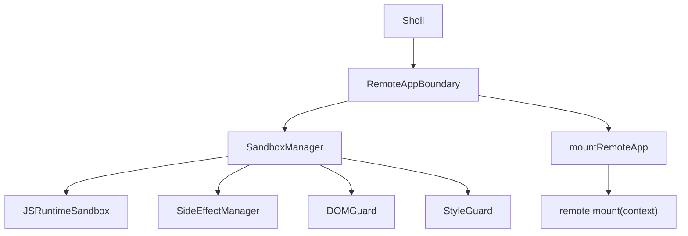
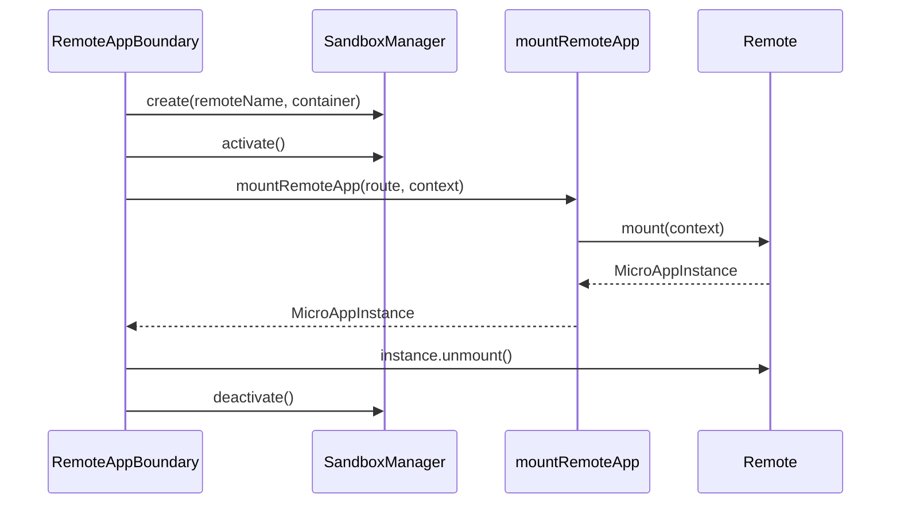

# Federlet 沙箱实现建议

## 结论

Federlet 不建议一开始复制 qiankun 的完整沙箱模型。更合适的方向是做一套分层治理型沙箱：默认使用轻量 Proxy/副作用沙箱治理可信 remote，保留 iframe 作为高风险 remote 的强隔离选项。

Module Federation 负责远程模块加载和依赖共享，但不提供运行时隔离边界。因此 Federlet 要补的不是另一套加载器，而是围绕 `mount(context)` 生命周期建立 remote 级运行时治理能力。

## 设计目标

第一阶段沙箱目标应聚焦在可落地、收益明确的能力：

- 降低 remote 写入 `window.xxx` 污染 Shell 的风险。
- 自动追踪并清理 timer、window listener、raf 等常见全局副作用。
- 保留现有 `context.container` DOM 容器契约和样式隔离策略。
- 提供 remote 级诊断信息，帮助定位哪个 remote 泄漏了副作用。
- 不承诺把可信 remote 变成安全不可信代码容器。

不建议第一阶段追求：

- 完整 HTML Entry 加载模型。
- qiankun 式动态资源重写和样式重建。
- 对恶意 remote 的强安全隔离。
- 强制所有 Module Federation chunk 都在 Proxy global 下执行。

## 推荐总体架构



沙箱不应替代 Federlet 现有边界，而应在现有边界外补一层生命周期治理：

- `RemoteAppBoundary` 继续负责 remote 的加载、挂载、卸载、错误态和重试。
- `mountRemoteApp` 继续只关心 Module Federation 模块加载和 `mount(context)` 协议校验。
- `SandboxManager` 按 remote 管理沙箱实例，把沙箱生命周期绑定到 remote 生命周期。
- `DOMGuard` 和 `StyleGuard` 继续沿用 Federlet 当前的容器契约、样式 scope 和逃逸检测路线。

## 分层能力

### P0：强化现有契约

这一层不是 JS 沙箱，但它是 Federlet 沙箱能稳定工作的前提。

需要继续坚持：

- remote 必须通过 `mount(context)` 接入。
- remote 只能渲染到 `context.container`。
- Portal、Modal、Dropdown、Toast、Tooltip 等浮层必须挂到 remote 容器内。
- 样式优先走构建期 scope。
- DOM 逃逸检测继续保留。
- remote 的 `unmount()` 必须清理自身框架实例、DOM、订阅和业务副作用。

这一层的目标是让 remote 接入模型保持可预测，避免后续沙箱承担过多业务兼容负担。

### P1：轻量 JS 副作用沙箱

这是 Federlet 最适合优先实现的沙箱层。

建议新增 `@federlet/sandbox` 包，提供：

```ts
type SandboxMode = "off" | "proxy" | "iframe";

interface SandboxOptions {
  mode?: SandboxMode;
  remoteName: string;
  container: HTMLElement;
  extraGlobals?: Record<string, unknown>;
  strictGlobal?: boolean;
}

interface FederletSandbox {
  globalThis: WindowProxy;
  activate(): void;
  deactivate(): void | Promise<void>;
  getDiagnostics(): SandboxDiagnostics;
}
```

第一版优先覆盖：

- `window.addEventListener/removeEventListener`
- `setInterval/clearInterval`
- `setTimeout/clearTimeout`
- `requestAnimationFrame/cancelAnimationFrame`
- `window.onerror`
- `window.onunhandledrejection`
- 可选：`history.pushState/replaceState`

如果复用 `lego-sandbox`，它可以作为 Proxy/Membrane 起点，但建议补齐 `setTimeout`、`requestAnimationFrame`、history 等 Federlet 更常遇到的副作用治理能力。

### P2：强隔离选项

如果 remote 是可信团队内部应用，默认不必启用 iframe。  
如果 remote 来自不可信团队、第三方、低治理质量项目，建议支持 iframe 模式。

推荐配置形态：

```ts
sandbox: {
  mode: "proxy" | "iframe" | "off";
  strictGlobal?: boolean;
  allowStorage?: boolean;
  allowDocumentWrite?: boolean;
}
```

`proxy` 模式用于低成本治理，`iframe` 模式用于强隔离。两者不应混为一种能力，因为它们的运行模型、通信方式、性能成本和兼容成本都不同。

## 核心模块建议

### SandboxManager

`SandboxManager` 是 Shell 生命周期和沙箱实例之间的桥。

职责：

- 按 `remoteName` 创建 sandbox。
- mount 前激活 sandbox。
- unmount 后释放 sandbox。
- 把 remote instance 与 sandbox instance 绑定。
- 处理快速路由切换、重试、加载取消等竞态。
- 提供 remote 级调试信息，例如注册了哪些 listener、timer、raf。

推荐生命周期：



### JSRuntimeSandbox

`JSRuntimeSandbox` 负责 `window` 层面的隔离。

建议能力：

- Proxy global。
- 记录新增和修改过的全局变量。
- 支持白名单共享变量，例如 Module Federation runtime 必需字段。
- 支持 `extraGlobals`，让 Shell 显式注入安全上下文。
- unmount 时恢复或丢弃 remote 写入的全局状态。

需要明确边界：Module Federation remote chunk 的加载和 shared scope 初始化由 MF runtime 控制，不一定天然跑在 proxy global 下。第一版不要承诺所有 JS 都被强制隔离，应只承诺生命周期内可追踪和清理全局副作用。

### SideEffectManager

`SideEffectManager` 是实际收益最大的部分。

建议追踪：

- timer：`setTimeout`、`setInterval`
- raf：`requestAnimationFrame`
- event：`addEventListener`
- history：`pushState`、`replaceState`、`popstate` listener
- global handler：`onerror`、`onunhandledrejection`
- 可选：`MutationObserver`、`ResizeObserver`、`IntersectionObserver`

每类副作用都应记录 owner remote，并在 remote unmount 时自动清理。

### DOMGuard

Federlet 当前已有 DOM 逃逸检测，建议继续走检测和规范路线，暂时不要默认做 qiankun 式 `document.head/body` 重定向。

后续可增强：

- 开发态拦截或告警 `document.body.appendChild`。
- 给 remote 创建的逃逸节点打 owner 标记。
- unmount 后检查并清理 remote 逃逸节点。
- 提供统一 `getOverlayContainer(context)` 帮助组件库浮层挂回容器。

### StyleGuard

不要把样式隔离交给 JS 沙箱。

建议继续：

- 构建期 scope class。
- 运行时样式污染检测。
- CSS-in-JS 接入规范。
- 组件库统一封装 `getPopupContainer`、`appendTo`、`teleport` 等容器配置。

如果需要更强 CSS 边界，再评估 Shadow DOM，但它会带来组件库、Portal、样式变量、字体和弹层定位等兼容成本。

## 主流方案参考

| 方案 | 关键特点 | 对 Federlet 的启发 |
| --- | --- | --- |
| Module Federation | 解决远程模块加载和依赖共享，不提供沙箱 | Federlet 需要自建运行时治理层 |
| qiankun | Proxy/Snapshot 沙箱 + HTML Entry + 动态资源劫持 | 能力完整，但直接复制会引入过重 loader 和 DOM patch |
| wujie | iframe 提供更强 JS 隔离 | 可作为 Federlet 高风险 remote 的强隔离模式参考 |
| micro-app | WebComponent + 沙箱 + 样式隔离 | 可参考容器化思想，但需评估运行时 patch 成本 |

对 Federlet 来说，最合理的路径是默认使用 Proxy/副作用沙箱，保留 iframe 作为强隔离选项。

## 推荐落地路线

### 第一阶段：诊断优先

- 增加 remote 级副作用统计。
- 开发态输出 remote 注册的 timer、listener、raf。
- 在 unmount 后报告未清理副作用。
- 不改变 remote 执行语义。

### 第二阶段：自动清理

- 引入 `@federlet/sandbox`。
- 接入 `RemoteAppBoundary` 生命周期。
- 自动清理 timer、listener、raf。
- 增加路由切换和异常卸载测试。

### 第三阶段：Proxy 全局隔离

- 对 remote 写入的 `window.xxx` 做隔离或恢复。
- 支持 `extraGlobals`。
- 明确 Module Federation runtime 白名单。
- 输出 remote 级 global mutation 诊断。

### 第四阶段：强隔离模式

- 为 route 或 manifest 增加 `sandbox.mode`。
- 支持 iframe sandbox。
- 设计 Shell 与 iframe remote 的通信协议。
- 增加 CSP、来源校验和权限上下文下发策略。

## 测试建议

沙箱能力必须有行为测试，否则很容易变成只在理想路径有效。

建议覆盖：

- remote 写入 `window.__REMOTE_GLOBAL__` 后，切换路由不污染其他 remote。
- remote 注册 `setInterval` 后，unmount 自动清理。
- remote 注册 `window.addEventListener` 后，unmount 自动移除。
- remote 注册 `requestAnimationFrame` 后，unmount 自动取消。
- route 快速切换时，旧 remote 的清理不影响新 remote。
- remote mount 失败时，sandbox 仍被释放。
- remote unmount 抛错时，sandbox 仍执行兜底清理。
- Portal 写入 `document.body` 时，开发态能检测并定位 remote。

## 最终建议

Federlet 应该做分层治理型沙箱，而不是 qiankun 复制版沙箱。

短期目标是让 trusted remote 更可控：减少全局变量污染，自动清理副作用，并提供诊断能力。中长期再根据 remote 信任边界决定是否升级到 dynamic append、Shadow DOM 或 iframe。

对应到实现优先级：

1. 先做副作用追踪和诊断。
2. 再做自动清理。
3. 再做 Proxy global 隔离。
4. 最后按需提供 iframe 强隔离。

这样既符合 Federlet 当前 Module Federation 架构，也能避免一开始把沙箱复杂度推到 qiankun 级别。
