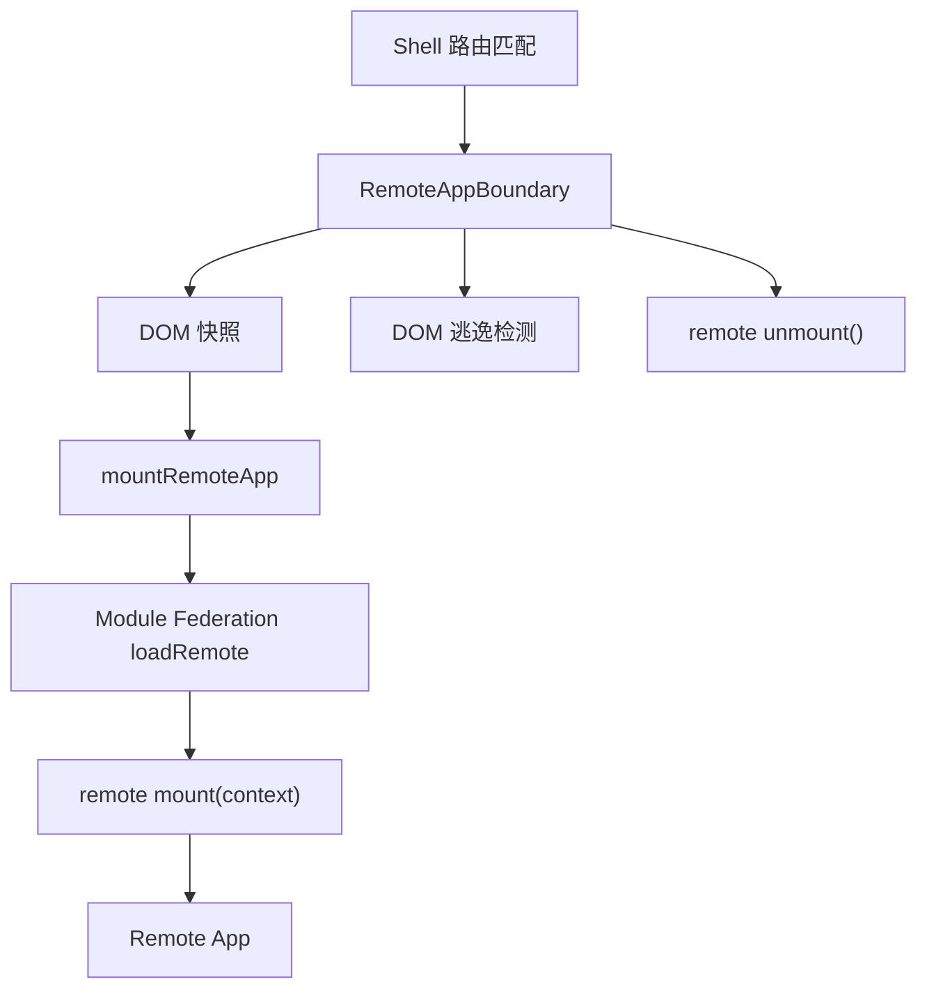
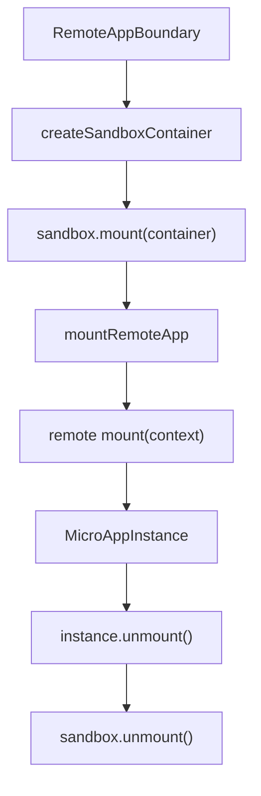

# Federlet 沙箱策略评估报告

## 结论

`lego-sandbox` 可以作为 Federlet 的轻量 JS 全局隔离补充，但不足以单独承担完整沙箱。

在 Federlet 当前的架构下，它的价值主要是降低 remote 对 `window` 全局变量、`setInterval` 和 `addEventListener` 的污染风险。它不负责 DOM 容器重定向、动态资源追踪、CSS 运行时隔离、Portal 约束或 Module Federation shared scope 隔离。因此，如果 Federlet 继续采用 `Module Federation + 显式 mount(context.container) + 构建期样式隔离 + DOM 逃逸检测` 的路线，`lego-sandbox` 基本够用，但只能作为补充层。

如果目标是 qiankun 式 HTML Entry、动态 `<script>` / `<style>` / `<link>` 拦截、`document.head/body` 代理和样式重建能力，当前 `lego-sandbox` 不够用。

## 背景

Federlet 当前没有 JS 沙箱。`ROADMAP.md` 在阶段四中把 `JS 运行时隔离/沙箱策略` 和 `remote 全局副作用治理` 列为待办项，说明这不是阶段一 MVP 的既有能力，而是后续隔离与安全治理的一部分。

当前 Federlet 的核心运行链路很短：



关键点是：Federlet 不是 HTML Entry 加载模型，而是 Module Federation 加载 remote 暴露模块，并要求 remote 导出统一的 `mount(context)` 生命周期。

## Federlet 现有隔离边界

Federlet 目前已有的隔离能力主要在框架契约和构建期，而不是 JS 沙箱。

| 能力         | 当前状态                                                    | 依据                                         |
| ------------ | ----------------------------------------------------------- | -------------------------------------------- |
| 生命周期协议 | remote 暴露 `mount(context)` 并返回 `unmount()`             | `packages/mf-runtime/src/loader.ts`          |
| 容器挂载     | Shell 创建容器并通过 `context.container` 注入               | `apps/shell-react/src/RemoteAppBoundary.tsx` |
| DOM 逃逸检测 | mount/unmount 前后做 DOM 快照对比，开发态报错               | `apps/shell-react/src/RemoteAppBoundary.tsx` |
| DOM 约束规范 | remote 不应写 `document.body`、Shell 布局或其他 remote 容器 | `docs/remote-dom-container-isolation.md`     |
| 样式隔离     | 以构建期 scope class 和污染检测为主                         | `docs/style-isolation.md`                    |
| JS 沙箱      | 尚未实现                                                    | `ROADMAP.md`                                 |

`packages/mf-runtime/src/loader.ts` 中的 `mountRemoteApp` 只负责加载 remote 模块、校验 `mount` 函数并调用：

```ts
const remoteModule = (await loader(moduleName)) as Partial<RemoteMountModule>;

if (typeof remoteModule.mount !== "function") {
  throw new Error(`Remote ${moduleName} does not expose a mount function.`);
}

return remoteModule.mount(context);
```

`apps/shell-react/src/RemoteAppBoundary.tsx` 是最自然的沙箱接入点，因为它已经持有 remote 的加载、挂载、卸载和 DOM 检测生命周期：

```ts
const instance = await mountRemoteApp(route, {
  basename: route.basename,
  container: containerRef.current,
  props: {
    mountedAt: new Date().toISOString(),
  },
});
```

## `lego-sandbox` 提供的能力

`lego-sandbox` 是从 `@qiankunjs/sandbox` fork 出来的精简包。它保留了 JS 全局隔离主干，但裁掉了 qiankun 内部和 HTML Entry、动态资源、DOM 容器、样式隔离相关的大量能力。

| 能力                                  | 是否支持 | 说明                                                                    |
| ------------------------------------- | -------- | ----------------------------------------------------------------------- |
| Proxy/Membrane 全局隔离               | 支持     | `lib/core/membrane/index.js` 中通过 Proxy 拦截 `get/set/deleteProperty` |
| `createSandboxContainer` 生命周期     | 支持     | `lib/core/sandbox/index.js` 返回 `instance/mount/unmount`               |
| `window/self/globalThis` 指向沙箱代理 | 支持     | `StandardSandbox` 内置 intrinsics                                       |
| 全局变量写入隔离                      | 部分支持 | 非白名单写入进入 sandbox target                                         |
| `fetch` 等原生函数重绑定              | 支持     | 避免 Illegal invocation                                                 |
| `setInterval` 清理                    | 支持     | `lib/patchers/windowInterval.js`                                        |
| `addEventListener` 清理               | 支持     | `lib/patchers/windowListener.js`                                        |
| `document` 容器代理                   | 不支持   | `document` 仍是真实 document                                            |
| 动态 script/style/link 追踪           | 不支持   | 无 `dynamicAppend`                                                      |
| CSSOM `insertRule` 隔离               | 不支持   | 无 qiankun 的 CSSOM patch                                               |
| `historyListener`                     | 不支持   | patcher 中已注释                                                        |
| `Compartment.makeEvaluateFactory`     | 不支持   | 简化版 Compartment 删除执行工厂                                         |

`lib/patchers/index.js` 能看出它的裁剪方向：bootstrap 阶段不做 patch，mount 阶段只启用 interval 和 window listener。

```js
export function patchAtBootstrapping(appName, opts) {
  return [];
}

export function patchAtMounting(appName, opts) {
  const { sandbox } = opts;
  const patchers = [
    () => patchWindowInterval(sandbox.globalThis),
    () => patchWindowListener(sandbox.globalThis),
  ];
  return patchers.map((patch) => patch());
}
```

## 与 qiankun 内部 sandbox 的关键差异

qiankun 内部 `packages/sandbox` 的职责更完整，它不只是 JS 全局隔离，还包含 DOM 和动态资源治理。

| 模块                     | qiankun 内部 sandbox                                              | `lego-sandbox`                         |
| ------------------------ | ----------------------------------------------------------------- | -------------------------------------- |
| `createSandboxContainer` | 接收 `getContainer`、`fetch`、`nodeTransformer`、`styleIsolation` | 只接收 `globalContext`、`extraGlobals` |
| `patchAtBootstrapping`   | 对标准沙箱启用 `patchStandardSandbox`                             | 空操作                                 |
| `patchAtMounting`        | interval、window listener、history、dynamic append                | interval、window listener              |
| `dynamicAppend`          | 代理 document、head/body、动态资源和样式重建                      | 缺失                                   |
| `styleIsolation`         | 支持样式转译和 CSSOM patch                                        | 缺失                                   |
| `qiankun-head/body`      | 用于容器内 head/body 语义                                         | 缺失                                   |
| `Compartment`            | 保留 `makeEvaluateFactory`                                        | 删除执行工厂                           |
| `SandboxType`            | 标准沙箱和快照沙箱类型分发                                        | 删除类型分发                           |

影响最大的是 `dynamicAppend` 缺失。qiankun 内部的 `patchers/dynamicAppend/forStandardSandbox.ts` 会代理 `document.head`、`document.body`、`document.querySelector("head" | "body")`、`document.createElement`，并追踪动态样式和脚本。`lego-sandbox` 没有这部分，因此无法拦截 remote 直接向真实 `document.head` 或 `document.body` 写入节点。

## 适用性判断矩阵

| 目标场景                                      | 是否够用 | 判断                                                 |
| --------------------------------------------- | -------- | ---------------------------------------------------- |
| 降低 remote 写 `window.xxx` 污染 Shell 的风险 | 基本够用 | Membrane 可以把多数写入留在沙箱 target               |
| 清理 remote 遗留的 `setInterval`              | 基本够用 | mount 阶段会追踪并在 unmount 时清理                  |
| 清理 remote 遗留的 window event listener      | 部分够用 | 可以追踪清理，但监听仍注册在真实 window 上           |
| Federlet 当前 MF + 显式容器挂载路线           | 有限够用 | 可作为 JS 隔离补充，DOM/CSS 仍靠 Federlet 自己治理   |
| 阻止 Portal 写入 `document.body`              | 不够用   | 没有 document/body 代理                              |
| 隔离动态 `<style>` / `<link>` / CSS-in-JS     | 不够用   | 没有 dynamicAppend 和 CSSOM patch                    |
| 隔离 Module Federation shared scope           | 不够用   | shared scope 仍由 MF runtime 管理                    |
| 支持 qiankun 式 HTML Entry 沙箱               | 不够用   | 缺少资源加载、转译、重建链路                         |
| 强安全边界，防止不可信 remote 访问宿主        | 不够用   | Proxy 沙箱不是安全容器，不能替代 iframe/CSP/权限模型 |

## 推荐接入方式

如果要在 Federlet 中引入 `lego-sandbox`，建议定位为可选的 JS 全局隔离层，而不是完整沙箱层。

建议新增框架侧胶水层，例如 `packages/mf-runtime` 或 Shell 侧单独封装：



推荐的生命周期顺序：

1. Shell 在 remote mount 前为 `route.remoteName` 创建 sandbox。
2. 调用 `sandboxContainer.mount(container)` 激活 sandbox，并开启 interval/listener patch。
3. 调用 `mountRemoteApp(route, context)` 挂载 remote。
4. 保存 remote instance 和 sandbox container 的绑定关系。
5. remote 卸载时先调用 `instance.unmount()`，再调用 `sandboxContainer.unmount()` 清理全局副作用。
6. 保留现有 `captureRemoteDomSnapshot` 和 `detectRemoteDomEscapes`，继续检测 DOM 逃逸。

需要特别注意：仅仅创建 sandbox 并不能自动让所有 remote 代码都在 `sandbox.globalThis` 下执行。Module Federation remote chunk 的加载和 shared scope 初始化仍由 MF runtime 完成。要让 remote 对 `window` 的访问尽量落在沙箱代理上，后续需要验证 remote 暴露模块的执行时机，并评估是否需要在加载器或编译侧注入额外包装。

## 不建议做的事

不建议把 `lego-sandbox` 当作 Federlet 的完整隔离方案。尤其不应因为引入它就放松以下约束：

- remote 必须挂载到 `context.container`。
- Portal、Modal、Toast、Dropdown 等浮层必须挂回 remote 容器。
- remote 不得修改 `document.body`、`document.documentElement`、Shell 布局和其他 remote 容器。
- 样式隔离仍应由 `@federlet/style-isolation` 和构建期 scope 策略负责。
- DOM 逃逸检测仍应保留，至少在开发态继续报错。

也不建议在第一步就移植 qiankun 的完整 `dynamicAppend`。Federlet 当前不是 HTML Entry 模型，直接移植会把 qiankun loader、nodeTransformer、styleIsolation、容器 head/body 语义一并带进来，复杂度明显高于当前框架阶段。

## 风险

### JS 执行边界不完整

`lego-sandbox` 删除了 `Compartment.makeEvaluateFactory`，也没有接管 Module Federation runtime 的 chunk 执行。它更适合管理 remote 生命周期期间对代理 global 的访问和部分副作用，而不是强制所有 remote 代码都在沙箱作用域中执行。

### DOM 仍是最大缺口

`StandardSandbox` 中的 `document` 指向真实 `document`。这意味着 remote 仍可直接调用：

```ts
document.body.appendChild(node);
document.head.appendChild(style);
document.documentElement.classList.add("remote-global-class");
```

这些行为无法被 `lego-sandbox` 阻止，只能由 Federlet 当前的容器契约、开发态逃逸检测、remote 接入规范和测试来约束。

### CSS-in-JS 与动态样式仍可能泄漏

styled-components、emotion、style-loader 或第三方组件库动态注入的 `<style>` 不会被 `lego-sandbox` 追踪和重建。Federlet 需要继续依赖构建期样式隔离、组件库配置和 DOM 逃逸检测。

### 不是安全沙箱

Proxy 沙箱不能阻止恶意 remote 主动访问真实全局对象、存储、网络或 DOM。若 Federlet 后续要加载不可信 remote，需要另行设计 iframe、CSP、来源校验、权限模型和敏感上下文下发策略。

## 补齐路线

### P0：维持现有隔离契约

继续把 DOM 和 CSS 隔离留在 Federlet 框架层：

- 保持 `context.container` 挂载协议。
- 保持 `docs/remote-dom-container-isolation.md` 中的 Portal 和 DOM 所有权约束。
- 保持构建期样式 scope。
- 保持开发态 DOM 逃逸检测。
- 为 remote 契约、Portal 容器和卸载清理补测试。

### P1：引入轻量 JS 沙箱胶水层

在 Shell 或 `@federlet/mf-runtime` 上层增加可选 sandbox wrapper：

- 按 remote 创建 `createSandboxContainer(remoteName, { extraGlobals })`。
- 在 `RemoteAppBoundary` 生命周期中激活和释放 sandbox。
- 把 remote instance 与 sandbox 绑定，确保 unmount 顺序稳定。
- 增加集成测试，覆盖 `window.xxx` 写入、interval 清理、listener 清理和路由切换。
- 明确文档：该层只治理 JS 全局副作用，不承诺 DOM/CSS 隔离。

### P2：按需求补强运行时隔离

如果后续业务确实需要 qiankun 级运行时隔离，再评估以下选项：

| 方案                          | 适用场景                                             | 成本                                     |
| ----------------------------- | ---------------------------------------------------- | ---------------------------------------- |
| 移植 `dynamicAppend` 等价能力 | 需要拦截动态 style/script/link 和 document head/body | 高，需要适配 Federlet 容器和 MF 加载模型 |
| Shadow DOM                    | 更强 DOM/CSS 边界，但 JS 仍共享 window               | 中，需要处理样式、Portal、组件库兼容     |
| iframe 沙箱                   | 不可信 remote 或强安全边界                           | 高，需要解决通信、路由、性能和样式一致性 |
| 继续约束式隔离                | 可信团队、统一接入规范、追求低复杂度                 | 低，但依赖规范和测试                     |

## 最终建议

Federlet 当前不应该直接追求 qiankun 完整沙箱模型。更合适的策略是：

1. 短期继续坚持容器契约、构建期样式隔离和 DOM 逃逸检测。
2. 中期把 `lego-sandbox` 作为可选 JS 全局隔离补充，优先覆盖 `window.xxx`、interval、window listener 这类低成本收益点。
3. 长期根据 remote 信任边界决定是否升级到 dynamicAppend、Shadow DOM 或 iframe。

因此，对“`@package` 里的实现够不够用”这个问题的回答是：对 Federlet 当前路线，够作为第一阶段 JS 沙箱补丁；对完整沙箱，不够。

## 参考文件

- `ROADMAP.md`
- `docs/architecture-stage-1.md`
- `docs/remote-dom-container-isolation.md`
- `docs/style-isolation.md`
- `packages/mf-runtime/src/loader.ts`
- `apps/shell-react/src/RemoteAppBoundary.tsx`
- `/Users/xiezhoulin/workspace/sandbox/package/lib/core/sandbox/index.js`
- `/Users/xiezhoulin/workspace/sandbox/package/lib/core/membrane/index.js`
- `/Users/xiezhoulin/workspace/sandbox/package/lib/patchers/index.js`
- `/Users/xiezhoulin/workspace/qiankun/packages/sandbox/src/patchers/index.ts`
- `/Users/xiezhoulin/workspace/qiankun/packages/sandbox/src/patchers/dynamicAppend/forStandardSandbox.ts`
